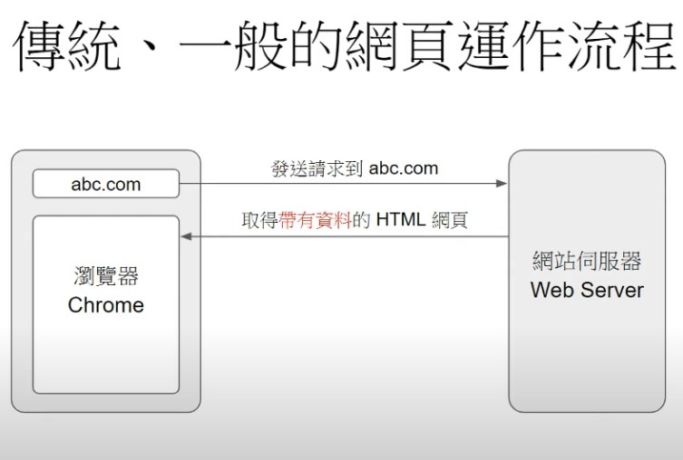
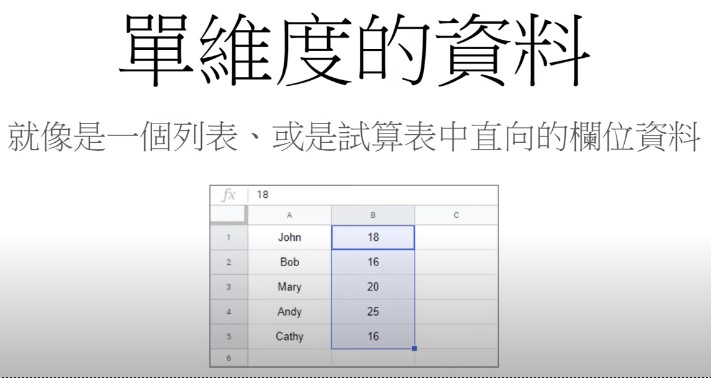

# Python 筆記

[Python 入門教學課程](https://www.youtube.com/playlist?list=PL-g0fdC5RMboYEyt6QS2iLb_1m7QcgfHk)


###### <br/>

---

###### <br/>


## 快速開始 <br/> 01_start.py

1. 在 D 槽建立新資料夾 (python)

2. 於 VS Code 的左上方工具列找到檔案 → 開啟資料夾 → 找到 D 槽建立的資料夾 (python)

3. 新增檔案，主檔名 隨便 (建議英文)，副檔名為 .py

4. 切到終端機 (TERMINAL)

5. 執行 → python 1_start.py → `enter`

- 若要清空 TERMINAL 畫面 → cls `enter`

- 註解：程式碼內打 #，# 後面可任意加寫文字，不會影響程式執行

###### <br/>
###### <br/>
###### <br/>


## 變數 & 資料 & 資料型態 <br/> 02_datatype.py

- 資料：程式中最基本的單位

- 資料型態 (Data type)：資料的分類

- 資料的分類

	- 數字：整數、長整數、浮點數 (小數)

	- 字串：任意的文字內容

	- 布林值：表達正確 (True) 或錯誤 (False)，T&F需大寫

	- 可變列表 (List)：有順序、可變動的資料集合，ex. 學生的成績

	- 固定列表 (Tuple)：有順序、不可變動的資料集合

	- 集合 (Set)：無順序的資料集合，ex. 水果

	- 字典：鍵值對 (Key-Value Pair) 的集合， 程式中做資料查詢 (ex. A對應到B)

- 變數 (variable)：可用來存放資料的自訂名稱，可在程式中建立名稱，未來可用自訂名稱代表資料，變數用英文，開頭不可是數字

- 字串：在程式中表達任意的文字，ex. 測試中文 是錯誤的語法，Python 語法為英文，但若想表達中文，用雙引號 (或單引號) 包起來，ex. "測試中文"、"HelloWorld"

	- 雙引號 (或單引號) 中能寫任意文字

###### <br/>
###### <br/>
###### <br/>


## 數字、字串的基本運算 <br/> 03_number-string.py

### 數字

- 基本算術運算：加 (+)、減 (-)、乘 (*)、除 (/)、取餘數 (%)

- 除法詳解：整數除法 (//)、小數除法 (/)

- X 的 Y 次方 ```X ** Y```、開根號 ```X ** 0.5```

### 字串

- 表示法詳解：雙引號 (")、單引號 (')、多行文字

- 重複 & 串接：重複相同文字或串接多個字串

- 索引 & 字元：使用索引 [] 操作字串中的字元

### 數字運算

- ```x = x + 1``` ，左邊 x 為變數，右邊 (x + 1) 要先看

- ```x = x + 1``` 可寫成 ```x += 1```

### 字串運算

```
s = "Hello"
print(s)

→

Hello
```

```
s = "Hell\"o"
print(s)

→

Hell"o
```

#### \"：跳脫

```
s = "Hello" + "World" = "Hello"  "World"
print(s)

→

HelloWorld
```

```
s = "Hello\nWorld"
print(s)

→

Hello
World
```

#### \n：跳行

```
s = """Hello
World"""
print(s)

→

Hello
World
```

##### 單雙引號皆可，前後各 3 個，中間可任意空行 (與跳行相同，兩者皆可使用)

```
s = "Hello" * 3
print(s)

→

HelloHelloHello
```

```
s = "Hello" * 3 + "World"
print(s)

→

HelloHelloHelloWorld
```

### 字串內部字元編號 (索引) 

```
s = "Hello"
print(s[0])

→

H
```

```
s = "Hello"
print(s[2])

→

l
```

##### Hello 中，H 為 0、e 為 1、l 為 2、l 為 3、o 為 4，5 沒有東西

```
s = "Hello"
print(s[1: 4])

→

ell
```

##### 包含開頭，不包含結尾

###### <br/>
###### <br/>
###### <br/>


## 數字、字串的基本運算 <br/> 04_list-tuple.py

### 2 種有序列表型態：List & Tuple

- List (List 的寫法為中括號 [] )

	- 索引基本運用：取得、更新列表中的資料

	- 連續資料處理：串接、取代、連續刪除列表中的資料

	- 取得列表長度：len (列表)

	- 巢狀列表：列表中的資料也是列表

- Tuple ( Tuple 的寫法為小括號 () )

	- 資料不可更動，操作與 List 相同，但資料不可更動

### 有序可變動列表List

```
grades = [12, 60, 15, 70, 90]
print(grades)

→

[12, 60, 15, 70, 90]
```

```
grades = [12, 60, 15, 70, 90]
print(grades[0])

→

12
```

```
grades = [12, 60, 15, 70, 90]
grades[0] = 55
print(grades)

→

[55, 60, 15, 70, 90]
```

```
grades = [12, 60, 15, 70, 90]
print(grades[1: 4])

→

[60, 15, 70]
```

```
grades = [12, 60, 15, 70, 90]
# 連續刪除列表
grades[1: 4] = [] 
print(grades)

→

[12, 90]
```

```
grades = [12, 60, 15, 70, 90]
grades = grades + [12, 33]
print(grades)

→

[12, 60, 15, 70, 90, 12, 33]
```

##### 看到等號先看等號右邊

##### 可輕易做到表的串接

### 槽狀列表

```
data = [[3, 4, 5], [6, 7, 8]]
print(data[0][1])

→

4
```

##### [3, 4, 5] 為第 0 層，[6, 7, 8] 為第 1 層；3 為 0、4 為 1、5 為 2、  6 為 0、7 為 1、8 為 2

```
data=[[3, 4, 5], [6, 7, 8]]
print(data[0][0: 2])

→

[3, 4]
```

```
data = [[3, 4, 5],[6, 7, 8]]
print(data)
data[0][0: 2] = [5, 5, 5]
print(data)

→

[[3, 4, 5], [6, 7, 8]]
[[5, 5, 5, 5], [6, 7, 8]]
```

##### [3, 4, 5] 為第 0 層，[6, 7, 8] 為第 1 層；3 為 0、4 為 1、5 為 2、  6 為 0、7 為 1、8 為 2

#### Tuple 所有操作與 List 相同，但 Tuple 資料不可更動

```
data = (3, 4, 5)
data[0] = 5
print(data)

→

error
```

##### 錯誤：Tuple 的資料不可以變動

###### <br/>
###### <br/>
###### <br/>


## 集合、字典的基本運算 – Set、Dictionary <br/> 05_set-dictionary.py

### 集合

- 基本觀念：一群資料沒有順序性 (列表有順序概念，集合沒有)

- 判斷資料是否存在：使用 in 和 not in 運算符號

	- 交集、聯集：使用 & 和 | 運算符號

		- 交集：取兩個集合中相同的資料

		- 聯集：取兩個集合中的所有資料，但不重複取

	- 差集、反交集：使用 - 和 ^ 運算符號

		- 差集：從A集合中減去和B集合重疊的資料

		- 反交集：取兩個集合中不重疊的資料

- 字串拆解為集合：set (字串)

### 字典

- 基本觀念：鍵值對 (Key-value Pair)，一個索引對一個資料

- key 對應 Value：字典[Key]；字典[Key] = Value

- 判斷資料是否存在：使用 in 和 not in 運算符號

- 刪除鍵值對：使用 del 運算關鍵字

- 從列表建立字典：以列表的資料為基礎來建立字典

### 集合的運算

```
s1 = {3, 4, 5}
print(3 in s1)

→

True
```

##### 檢視 3 有無在集合內，若有為 True，若無為 False

```
s1 = {3, 4, 5}
print(10 in s1)

→

False
```

```
s1 = {3, 4, 5}
print(10 not in s1)

→

True
```

```
s1 = {3, 4, 5}
s2 = {4, 5, 6, 7}
s3 = s1 & s2
print(s3)

→

{4, 5}
```

#### 交集 (&)：取兩個集合中相同的資料

```
s1 = {3, 4, 5}
s2 = {4, 5, 6, 7}
s3 = s1 | s2
print(s3)

→

{3, 4, 5, 6, 7}
```

#### 聯集 (|)：取兩個集合中的所有資料，但不重複取

```
s1 = {3, 4, 5}
s2 = {4, 5, 6, 7}
s3 = s1 - s2
print(s3)

→

{3}
```

#### 差集 (-)：從 s1 中減去和 s2 重疊的資料

```
s1 = {3, 4, 5}
s2 = {4, 5, 6, 7}
s3 = s1 ^ s2
print(s3)

→

{3, 6, 7}
```

#### 反交集 (^)：取兩個集合中不重疊的資料

```
s = set("Hello")
print(s)

→

{'H', 'o', 'e', 'l'}
```

##### 語法為 set (字串)：集合無順序觀念，TERMINAL 顯示順序為隨機，且重複部分不會重複顯示

```
s = set("Hello")

print("H" in s)

→

True
```
```
s = set("Hello")
print("h" in s)

→

False
```

### 字典的運算：Key-value 配對

```
dic = {"apple": "蘋果", "bug": "蟲蟲"}
print(dic["apple"])

→

蘋果
```

```
dic = {"apple": "蘋果", "bug": "蟲蟲"}
dic["apple"] = "小蘋果"
print(dic["apple"])

→

小蘋果
```

```
dic = {"apple": "蘋果", "bug": "蟲蟲"}
print("apple" in dic)

→

True
```

##### 判斷對象為 key 非 value

```
dic = {"apple": "蘋果", "bug": "蟲蟲"}
print(dic)
del dic["apple"]
print(dic)

→

{'apple': '蘋果', 'bug': '蟲蟲'}
{'bug': '蟲蟲'}

```

##### 刪除字典中的鍵值對 (key-value pair)，[] 中只能選 key 不能選 value

### 從列表的資料產生字典

#### 語法：```dic = {x: x * 2 for x in [列表]}```

##### 其中 for in 固定不變

```
dic = {x: x * 2 for x in [3, 4, 5]}
print(dic)

→

{3: 6, 4: 8, 5: 10}
```

###### <br/>
###### <br/>
###### <br/>


## 流程控制：if 判斷式 <br/> 06_condition.py

> 基本語法一

```
if 布林值:
	若布林值為 True，執行命令
```

##### 前面部分為縮排 ```Tab```

> 基本語法二

```
if 布林值:
	若布林值為 True，執行命令
else:
	若布林值為 False，執行命令
```

> 基本語法三

```
if 布林值一:
	若布林值一為 True，執行命令
elif 布林值二:
	若布林值二為 True，執行命令
else:
	若布林值一和二為 False，執行命令
```

##### 布林值一是 True，代表滿足條件，滿足第一個條件跑第一段，第一個條件不滿足就看第二個條件，如果滿足第二個條件跑第二段，若第一個條件和第二個條件都是 False (都不滿足)，才跑第三段

##### elif = else if

> 程式範例

```
x = input("請輸入數字：")   # 基本輸入為字串型態
x = int(x)   # 轉換為整數型態
if x > 200:
	print("大於 200")
elif x > 100:
	print("大於 100，小於 200")
else:
	print("小於 100")
```

##### 以上為 if 語法，至 3.6 版 Python 不支援 switch 語法

##### 用 ```x = input()``` 即可在 TERMINAL 進行輸入

##### 在 TERMINAL 中 input 的數字回到程式中為字串型態，所以需用 x = int(x) 將字串型態轉換為數字型態

> 判斷式

```
if True:
	print("True 執行")
	
→

True 執行
```

```
if False:
	Print("True 執行")

→

(會直接被忽略)
```

```
if True:
	print("True 執行")
else:
	print("False 執行")

→

True 執行
```

```
if False:
	print("True 執行")
else:
	print("False 執行")

→

False 執行
```

```
x = input("請輸入數字：")
x = int(x)
if x > 100:
	print("大於 100")
else:
	print("小於等於 100")

→

請輸入數字：(在 TERMINAL 隨意輸入數字，ex. 200)
大於 100
```

```
x = input("請輸入數字：")
x = int(x)
if x > 100:
	print("大於 100")
else:
	print("小於等於 100")

→

請輸入數字：(在 TERMINAL 隨意輸入數字，ex. 50)
小於等於 100
```

```
x = input("請輸入數字：")
x = int(x)
if x > 200:
	print("大於 200")
elif x > 100:
	print("大於 100，小於等於 200")
else:
	print("小於等於 100")

→

請輸入數字：150
大於 100，小於等於 200
```

```
n1 = int(input("請輸入數字一："))
n2 = int(input("請輸入數字二："))
op = input("請輸入運算：+、-、*、/：")
if op == "+":
	print(n1 + n2)
elif op == "-":
	print(n1 - n2)
elif op == "*":
	print(n1 * n2)
elif op == "/":
	print(n1 / n2)
else:
	print("不支援的運算")

→

請輸入數字一：(在 TERMINAL 隨意輸入數字) enter
↓
請輸入數字二：(在 TERMINAL 隨意輸入數字) enter
↓
請輸入運算：+、-、*、/：(在 TERMINAL 隨意輸入 +、-、*、/ 其一) enter
↓
(自動完成上述運算)
```

##### 程式邏輯：取得第一個數字放在 n1 → 取得第二個數字放在 n2 → 最後取得 +、-、*、/ 中的其中一個放在 op → 判斷式進行判斷是否為 True，若為 True 則跑該段

###### 建議有時間自行重寫練習

###### <br/>
###### <br/>
###### <br/>


## 流程控制：迴圈基礎，while 迴圈、for 迴圈 <br/> 07_loop-basic.py

#### 迴圈：寫一段程式後不斷重複執行

> while迴圈

>> 基本語法

```
while 布林值:
	若布林值為 True，執行命令
	回到上方，做下一次的迴圈判斷
```

>>  程式範例

```
n = 1
while n < 5:
	print("變數 n 的資料是：", n)
	n += 1

→

變數 n 的資料是： 1
變數 n 的資料是： 2  
變數 n 的資料是： 3  
變數 n 的資料是： 4 
```

> for 迴圈

>> 基本語法

```
for 變數名稱 in 列表或字串:
	將列表中的項目或字串中的字元逐一取出，逐一處理
```

>> 程式範例

```
n = 1
for x in [4, 1, 2]:
	print("逐一取得列表中的資料", x)

→

逐一取得列表中的資料 4
逐一取得列表中的資料 1
逐一取得列表中的資料 2
```

```
for c in "Hello":
	print("逐一取得字串中的字元", c)

→

逐一取得字串中的字元 H
逐一取得字串中的字元 e
逐一取得字串中的字元 l
逐一取得字串中的字元 l
逐一取得字串中的字元 o
```

>> 使用 range()

#### range() 可幫忙製造連續數字的列表

```
for 變數名稱 in range(3)
相當於
for 變數名稱 in  [0, 1, 2]
```

```
for 變數名稱 in range(3, 6)
相當於
for 變數名稱 in [3, 4, 5]
```

> while 迴圈

```
n = 1
while True:
	print(n)
	n += 1

→ (此迴圈為無窮迴圈，在 TERMINAL 中 ctrl + c 即可終止)
```

```
n = 1
while n <= 3:
	print(n)
	n += 1

→
1
2
3
```

>> 1 加到 10 用 while 迴圈：

```
n = 1
sum = 0   # 紀錄累加的結果
while n <= 10:
	sum = sum + n
	n += 1
print(sum)

→

55
```

> for 迴圈

```
for x in [3, 5, 1]:
	print(x)
→
3
5
1
```

```
for x in "Hello":
	print(x)

→

H
e
l
l
o
```

```
for x in range(5):
	print(x)

→

0
1
2
3
4
```

```
for x in range(5, 10):
	print(x)

→

5
6
7
8
9
```

>> 1 加到 10 用 for 迴圈：

```
sum = 0
for x in range(1, 11):   # 因為 0 不影響加法總和，所以 range(1, 11) 可寫成 range(11)
	sum = sum + x
	print(sum)

→

55
```

###### <br/>
###### <br/>
###### <br/>


## 流程控制：迴圈進階控制，braek、continue、else 命令 <br/> 08_loop-control.py

### 迴圈搭配的指令：break 和 continue (這兩個命令一定要跟迴圈做搭配，需寫在迴圈裡面)

> break

>> 強制結束迴圈

```
while 布林值:
	break

for 變數名稱 in 列表或字串:
	break
```

>> 程式範例

```
n = 1
while n < 5:
	if n == 3:
		break
	n += 1
print(n)

→

3
```

##### 程式邏輯：當 ```n = 1```，在 ```while n < 5:``` 中為 True，但在 ```if n == 3``` 為 False，所以不會執行 ```break```，```n += 1``` 讓 ```n = 2``` 回到迴圈，當 ```n = 2```，在 ```while n < 5:``` 中為 True，但在 ```if n == 3``` 為 False 所以不會執行 ```break```，```n + =1``` 讓 ```n = 3``` 回到迴圈，當 ```n = 3```，在 ```while n < 5:``` 中為 True，在 ```if n == 3``` 也為 True，執行 ```break```，停止程式

> continue

>> 強制繼續下一圈

```
while 布林值:
	continue
for 變數名稱 in 列表或字串:
	continue
```

>> 程式範例

```
n = 0
for x in [0, 1, 2, 3]:
	if x % 2 == 0:
		continue
	n += 1
print(n)

→

2
```

##### %：取餘數，mode；```x % 2 == 0``` 表示 x 被 2 整除

##### 程式邏輯：當 ```n = 0```，```x = 0``` 進入 ```if x % 2 == 0``` 為 True，執行 continue 進入下一圈 (忽略下方 (n += 1) 程式碼)，```x = 1``` 進入 ```if x % 2 == 0``` 為 False，不會執行 continue，```n += 1``` 讓 ```n = 1```，```x = 2``` 進入 ```if x % 2 == 0``` 為 True，執行 continue 進入下一圈，```x = 3``` 進入 ```if x % 2 == 0 為 False```，```n += 1``` 讓 ```n = 2```

##### 原本 ```n += 1``` 要執行 4 次，但因 continue 所以只執行 2 次

### 迴圈結構在最後面可以加 else 的語法

> else

>> 基本語法

```
while 布林值:
	若布林值為 True，執行命令
	回到上方，做下一次的迴圈判斷
else:
	迴圈結束前，執行此區塊的命令
```

```
for 變數名稱 in 列表或字串:
	將列表中的項目或字串中的字元逐一取出，逐一處理
else:
	迴圈結束前，執行此區塊的命令
```

>> 程式範例

```
n = 1
while n < 5:
	print("變數 n 的資料是：", n)
	n += 1
else:
	print(n)

→

5
```

```
for c in "Hello":
	print("逐一取得字串中的字元", c)
else:
	print(c)

→

o
```

### break 的簡易範例

```
n = 0
while n < 5:
	if n == 3:
		break
		print(n)   # 印出迴圈中的 n
	n += 1
print("最後的 n：", n)   # 印出迴圈結束後的 n

→

0
1
2
最後的 n： 3
```

###### crtl + 右邊 shift 旁的 / 可以直接進行註解

### continue 的簡易範例

```
n = 0
for x in [0, 1, 2, 3]:
	if x % 2 == 0:   # x 是偶數 %：取餘數
		continue
	print(x)
	n += 1
print("最後的 n：", n)

→

1
3
最後的 n： 2
```

### else 的簡易範例

```
sum = 0
for n in range(11):
	sum += n
else:
	print(sum)   # 印出 0 + 1 + 2 + 3 + ... + 10 的結果

→

55
```

### 綜合範例：找出整數平方根

#### 輸入 9，得到 3；輸入 11 得到 "沒有整數的平方根"：

```
n = input("輸入一個正整數：")
n = int(n)   # 轉換輸入成數字
for i in range(n):   # i 從 0 ~ n - 1
	if i * i == n:
	print("整數平方根", i)
	break   # 用 break 強制結束迴圈時，不會執行 else 區塊
else:
	print("沒有整數的平方根")

→

輸入一個正整數：25 enter
整數平方根 5
```

```
n = input("輸入一個正整數：")
n = int(n)   # 轉換輸入成數字
for i in range(n):   # i 從 0 ~ n - 1
	if i * i == n:
	print("整數平方根", i)
	break   # 用 break 強制結束迴圈時，不會執行 else 區塊
else:
	print("沒有整數的平方根")

→

輸入一個正整數：12 enter
沒有整數平方根
```

###### <br/>
###### <br/>
###### <br/>


## 函式基礎：定義並呼叫函式 <br/> 09_function-basic.py

> 函式

#### 程式區塊 (函式：程式碼包裝在一個區塊中，方便隨時呼叫，函式就是一個程式區塊)

#### 定義 > 呼叫：要先定義 (建立) 函式，然後才能呼叫 (使用) 函式

> 定義函式

>>基本語法

```
def 函式名稱(參數名稱):
	函式內部的程式碼
```

##### def 代表 define

>> 程式範例：定義一個印出 Hello 的函式

```
def sayHello():
	print("Hello")
```

##### sayHello 名字自取，但不可是中文及數字，只能是一般的英文

>> 程式範例：定義可以印出任何訊息的函式

```
def say(msg):
	print(msg)
```

##### 想法：把參數內的資料 ( () 內的資料) 印出來，暫時還不知道資料為何，只是先定義名字 (變數的概念)

>> 程式範例：定義一個可以做加法的函式

```
def add(n1, n2):
	result = n1 + n2
	print(result)
```

> 呼叫函式

>> 基本語法
```
函式名稱(變數資料)
```

>> 程式範例：定義一個印出 Hello 的函式

```
def sayHello():
	print("Hello")
sayHello()   # 呼叫上方定義的函式
```

##### 呼叫函式：跳到函式裡面

>> 程式範例：定義可以印出任何訊息的函式

```
def say(msg):
	print(msg)
say("Hello Function")   # 呼叫上方定義的函式
say("Hello Python")   # 呼叫上方定義的函式
```

##### 函式參數的設計在呼叫時有彈性

>> 程式範例：定義一個可以做加法的函式

```
def add(n1, n2):
	result = n1 + n2
	print(result)
# 呼叫上方定義的函式
add(3, 4)
add(7, 8)
```

> 回傳值

>> 基本語法

```
def 函式名稱(參數名稱):
	函式內部的程式碼
	return   # 結束函式，回傳None
```

##### 程式內寫下 return，代表程式強制結束

##### 資料：數字、字串、布林值、列表、字典、物件 …

>> 程式範例：函式回傳 None

```
def say(msg):
	print(msg)
	return
# 呼叫函式，取得回傳值
value = say("Hello Function")
print(value)

→

None
```

##### 函式呼叫的結果，就是回傳值，也就是 None (say("Hello Function"))，None 放進變數 value，印出 value，印出 None

>> 程式範例：函式回傳字串 Hello

```
def add(n1, n2):
	result = n1 + n2
	return "Hello"
# 呼叫函式，取得回傳值
value = add(3, 4)
print(value)

→

Hello
```

##### 程式邏輯：呼叫 add，3 放進 n1，4 放進 n2，3 + 4 = 7 放進 result，return 字串 Hello，字串 Hello 被丟回 ```add(3, 4)```，```add(3, 4)``` 為字串 Hello = value，印出 value

##### result 的 7 沒有用，因為 return 的是 Hello

##### 最後函式呼叫完得到的要看回傳值 (return)，和程式碼無關

>> 函式內部的程式碼，若是沒有做函式呼叫，就不會執行

```
def multiply():
	print(3 * 4)

→

無錯誤但不執行
```

##### 函式內部的 code (程式碼)，沒有呼叫就不會執行

```
def multiply():
	print(3 * 4)
multiply()

→

12
```

```
def multiply():
	print(3 * 4)
multiply()
multiply()

→

12
12
```

>> 透過參數得到彈性

```
def multiply(n1, n2):
	print(n1 * n2)
multiply(3, 4)
multiply(10, 8)

→

12
80
```

```
def  multiply(n1, n2):
	print(n1 * n2)
value=multiply(3, 4)
print(value)

→

12
None
```

```
def multiply(n1, n2):
	print(n1 * n2)
	return
value = multiply(3, 4)
print(value)

→

12
None
```

##### return後面沒有帶回傳值就跟沒寫一樣

```
def multiply(n1, n2):
	print(n1 * n2)
	return 10
value = multiply(3, 4)
print(value)

→

12
10
```

```
def  multiply(n1, n2):
	print(n1 * n2)
	return n1 * n2
value = multiply(3, 4)
print(value)

→

12
12
```

##### 可以直接在裡面印出來，也可以回傳到外面印出來

```
def multiply(n1, n2):
	return n1 * n2
value = multiply(3, 4)
print(value)

→

12
```

```
def multiply(n1, n2):
	print(n1 * n2)
	return n1 * n2
value = multiply(3, 4)

→

12
```

>> 回傳值的好處是可以在外部繼續操作

```
def multiply(n1, n2):
	return n1 * n2
value = multiply(3, 4) + multiply(10, 5)   # (3 * 4) + (10 * 5)
print(value)

→

62
```

> 程式的包裝

>> 同樣的邏輯可以重複利用

```
sum = 0
for n in range(1, 11):
	sum = sum + n
print(sum)

sum = 0
for n in range(1, 21):
	sum = sum + n
print(sum)

→

55
210
```

#### 類似的工作一直做 (copy test)，就會做程式的包裝

##### 函式最大的用途就是做程式的包裝

```
def calculate(max):
	sum = 0
	for n in range(1, max + 1):
		sum = sum + n
	print(sum)
calculate(10)
calculate(20)

→

55
210
```

###### <br/>
###### <br/>
###### <br/>


## 函式參數詳解：參數預設值、名稱對應、任意長度參數 (函式進階) <br/> 10_function-args.py

>預設資料

>> 基本語法

```
def 函式名稱(參數名稱 = 預設資料):
	函式內部的程式碼
```

>> 程式範例

```
# 參數 msg 預設資料為 "Hello"
def say(msg = "Hello"):
	print(msg)
# 印出 Hello Function
	say("Hello Function")
say()   # 印出預設資料Hello
```

##### 用 say("Hello Function") 會印出 Hello Function，但用 say() 因 () 無資料所以會採用預設資料

> 名稱對應

>> 基本語法

```
def 函式名稱(名稱1, 名稱2):
	函式內部的程式碼
# 呼叫函式，以參數名稱對應資料
函式名稱(名稱2 = 3, 名稱1 = 5)
```

##### 呼叫函式名稱式可以倒過來，重點是前面要加參數名稱

>> 程式範例

```
# 定義一個可以做除法的函數
def divide(n1, n2):
	result = n1 / n2
	print(result)
divide(2, 4)   # 印出 0.5
divide(n2 = 2, n1 = 4)   # 印出 2.0
```

> 無限參數

>> 基本語法

```
def 函式名稱(*無限參數):
	無限參數以 Tuple 資料型態處理函式內部的程式碼
# 呼叫程式，可傳入無限數量的參數
函式名稱(資料一, 資料二, 資料三)
```

##### 呼叫函式中可以放不定量的資料

>> 程式範例

```
# 函式接受無限參數 msgs
def say(*msgs):
	# 以 Tuple 的方式處理
	for msg in msgs
		print(msg)

# 呼叫函式，傳入三個參數資料
say("Hello", "Arbitrary", "Arguments")
```

##### 若給 3 個字串，就會變成 3 個字串的 Tuple，用一個迴圈將 Tuple 資料取出

#### Tuple：有序列表 (資料不可更動)，List 資料可更動

#### 參數的預設資料

```
def power(base, exp = 0):
	print(base ** exp)
power(3, 2)
power(4)

→

9
1
```

##### power(4) 因為沒有給次方數，因此帶入預設值 0

>> 使用參數對應名稱

```
def divide(n1, n2):
	print(n1 / n2)
divide(2, 4)
divide(n2 = 2, n1 = 4)

→

0.5
2.0
```

>> 無限 / 不定 參數資料

```
def avg(*ns):
	print(ns)
avg(3, 4)
avg(3, 5, 10)
avg(1, 4, -1, -8)

→

(3, 4)
(3, 5, 10)
(1, 4, -1, -8)
```

##### 參數的資料會變成 Tuple 的形態傳遞進去

```
def avg(*ns):
	for n in ns:
		print(n)
avg(3, 4)

→

3
4
```

```
def avg(*ns):
	sum = 0
	for n in ns:
		sum = sum + n
		print(sum / len(ns))
avg(3, 4)
avg(3, 5, 10)
avg(1, 4, -1, -8)

→

3.5
6.0
-1.0
```

##### len：列表 (Tuple) 的長度

###### <br/>
###### <br/>
###### <br/>


## Module 模組的載入與使用 <br/> 11_module.py

### Python 中所謂的模組，就是獨立的程式檔案，可以被其他的程式載入和使用，其中最大的好處是可以重複使用，在程式碼太長太多時可以寫成不同的檔案模組重複使用，這就是 Python 的模組要解決的問題

### 模組 (module)

- 獨立的程式檔案：將程式寫在一個檔案中，此檔案可重複載入使用 

- 載入 > 使用：先載入模組，再使用模組中的函式或變數

> 載入模組

>> 基本語法

```
import 模組名稱
```

```
import 模組名稱 as 模組別名
```

> 使用模組

>> 基本語法

```
模組名稱或別名.函式名稱(參數資料)
```

```
模組名稱或別名.變數名稱
```

> 內建模組 (Python 語言中已內建好的模組)

#### sys 模組：取得系統相關資料

>> 程式範例

```
# 載入sys模組
import sys

# 使用 sys 模組
print(sys.platform)   # 印出作業系統
print(sys.maxsize)   # 印出整數型態的最大值
print(sys.path)   # 印出搜尋模組的路徑
```

```
# 載入sys模組 
import sys as s   # s 是別名

# 使用 sys 模組
print(s.platform)   # 印出作業系統
print(s.maxsize)   # 印出整數型態的最大值
print(s.path)   # 印出搜尋模組的路徑
```

> 自訂模組

#### 建立幾何運算模組：建立檔案 geometry.py，定義平面幾何運算用的函式

##### 載入與使用：載入 geometry 模組，並使用模組中定義的功能

```
import sys

print(sys.platform)
print(sys.maxsize)

→ 

win32
9223372036854775807
```

```
import sys as system

print(system.platform)
print(system.maxsize)

→

win32
9223372036854775807
```

#### 建立 geometry 模組，載入使用 (自訂模組)

##### 先另開一個 Python 檔案命名 geometry.py，並在其中自訂模組

```
# 在 geometry 模組中定義幾何運算功能

# 計算兩個點的距離
def distance(x1, y1, x2, y2):
	return ((x2 - x1) ** 2 + (y2 - y1) ** 2) ** 0.5

# 計算線段的斜率
def slope(x1, y1, x2, y2):
	return (y2 - y1) / (x2 - x1)
```

##### 回到主程式 (11_module.py)

```
import geometry

result=geometry.distance(1, 1, 5, 5)
print(result)
result=geometry.slope(1, 2, 5, 6)
print(result)

→ 

5.656854249492381
1.0
```

##### 調整搜尋模組的路徑

```
import sys

print(sys.path)   # 印出模組的搜尋路徑列表

→ 

['D:\\Python-training','C:\\Users\\charmy\\AppData\\Local\\Programs\\Python\\Python310\\python310.zip','C:\\Users\\charmy\\AppData\\Local\\Programs\\Python\\Python310\\DLLs','C:\\Users\\charmy\\AppData\\Local\\Programs\\Python\\Python310\\lib','C:\\Users\\charmy\\AppData\\Local\\Programs\\Python\\Python310', 'C:\\Users\\charmy\\AppData\\Local\\Programs\\Python\\Python310\\lib\\site-packages']
```

##### 在資料夾中建立一個資料夾 (modules)，將 11_module.py 移入

```
import sys
import geometry

print(geometry.distance(1, 1, 5, 5))

→ 

Traceback (most recent call last):
  File "D:\Python-training\11_module.py", line 16, in <module>
	import geometry
ModuleNotFoundError: No module named 'geometry'
```

##### 在模組的搜尋路徑中，並沒有包含自己創建的資料夾(modules)，因此產生錯誤 

```
import sys

sys.path.append("modules")   # 在模組的搜尋路徑列表中[新增路徑]
print(sys.path)   # 印出模組的搜尋路徑列表
print("========================================")

import geometry
print(geometry.distance(1, 1, 5, 5))

→ 

['D:\\Python-training','C:\\Users\\charmy\\AppData\\Local\\Programs\\Python\\Python310\\python310.zip','C:\\Users\\charmy\\AppData\\Local\\Programs\\Python\\Python310\\DLLs','C:\\Users\\charmy\\AppData\\Local\\Programs\\Python\\Python310\\lib','C:\\Users\\charmy\\AppData\\Local\\Programs\\Python\\Python310', 'C:\\Users\\charmy\\AppData\\Local\\Programs\\Python\\Python310\\lib\\site-packages', 'modules']
========================================
5.656854249492381
```

##### 路徑的最後多了 'modules'

###### <br/>
###### <br/>
###### <br/>


## Package 封包的設計與使用 <br/> 12_main.py

### 封包：包含模組的資料夾(用來整理、分類模組程式)

- 檔案系統中的資料夾對應到 Python 的封包

- 檔案系統中的檔案對應到模組

> 建立封包

>> 專案檔案配置

```
- 專案資料夾
	- 主程式.py
	- 封包資料夾
		- __init__.py
		- 模組一.py
		- 模組二.py

# 有裝- __init__.py的資料夾才會被當作封包，若無- __init__.py則為普通資料夾，- __init__.py裡面留空即可，但檔案要建立，__為兩個底線
```

>> 專案檔案配置範例

```
- 專案資料夾
	- main.py
	- geometry
		- __init__.py
		- point.py
		- line.py
```

> 使用封包

>> 基本語法

```
import 封包名稱.模組名稱
```

```
import 封包名稱.模組名稱 as 模組別名
```

1. 新增資料夾 (backup)，將先前程式移入其中

2. 把程式放進 backup 後，要改寫成 python backup\檔案名.py 或先輸入 cd backup(資料夾名) 後輸入檔案名才能執行

3. 新增封包並在其中建立檔案 ```__init__.py```、```point.py```、```line.py ```

#### point.py

```
def distance(x, y):
	return (x ** 2 + y ** 2) ** 0.5
```

#### line.py

```
def len(x1, y1, x2, y2):
	return ((x2 - x1) ** 2) + ((y2 - y1) ** 2) ** 0.5
def slope(x1, y1, x2, y2):
	return (y2 - y1) / (x2 - x1)
```

#### main.py

```
import geometry.point
result = geometry.point.distance(3, 4)
print("距離", result)

import geometry.line
result = geometry.line.slope(1, 1, 3, 3)
print("斜率", result)

→ 

距離 5.0
斜率 1.0
```

##### geometry.point為模組的完整名稱

#### 若覺得封包名稱太長，可以使用別名

```
import geometry.point as point
result = point.distance(3, 4) 
print("距離", result) 

import geometry.line as line 
result = line.slope(1, 1, 3, 3) 
print("斜率", result) 

→ 

距離 5.0
斜率 1.0
```

###### <br/>
###### <br/>
###### <br/>


## 文字檔案的讀取和儲存 <br/> 13_file.py

### 檔案操作流程 ：開啟檔案 > 讀取或寫入 > 關閉檔案

> 開啟檔案

>> 基本語法

```
檔案物件 = open(檔案路徑, mode = 開啟模式)
```

- 開啟模式

- 讀取模式 - r

- 寫入模式(儲存) - w

-讀寫模式 – r+

> 讀取檔案

>> 讀取全部文字 

```
檔案物件.read()
```

>> 一次讀取一行 

```
for 變數 in 檔案物件:
	從檔案依序讀取每行文字到變數中
```

>> 讀取 JSON 格式

```
import json

讀取到的資料 = json.load(檔案物件)
```

- 資料格式 JSON 使用的非常頻繁，經常用於網路中交換資料或儲存設定檔

> 寫入檔案 (儲存檔案)   # 因為英文是 write 所以有翻譯問題

>> 寫入文字

```
檔案物件.write("字串")
```

>> 寫入換行符號

```
檔案物件.write("這是範例文字\n") 
```

>> 寫入 JSON 格式

```
import json

json.dump(要寫入的資料, 檔案物件)
```

> 關閉檔案

>> 基本語法

```
檔案物件.close()
```

> 最佳實務

```
with open(檔案路徑, mode = 開啟模式) as 檔案物件:
	讀取或寫入檔案的程式

# 以上區塊會自動、安全的關閉檔案
```

>> 儲存檔案

```
file = open("data.txt", mode="w")   # 開啟 
file.write("Hello File")   # 操作 
file.close()   # 關閉 

→

產生新的檔案data.txt在資料夾裡 
data.txt → 
Hello File 
```

#### 同一個檔案打開再重新寫入會有覆蓋的效果 (檔案的內容會被整個覆蓋)，即用新的資料覆蓋檔案裡的內容 

```
file = open("data.txt", mode = "w")
file.write("Hello File\nSecond Line")
file.close()

→

data.txt →
Hello File
Second Line
```

```
file = open("data.txt", mode = "w")
file.write("測試中文\n好棒棒")
file.close()

→

data.txt →
���դ���
�n�δ�
# 出現亂碼
```

#### 若要顯示中文，需要先指定utf-8編碼 (最常見的)

```
file = open("data.txt", mode = "w",encoding = "utf-8")
file.write("測試中文\n好棒棒")
file.close()

→

data.txt →
測試中文
好棒棒
```

> 最佳實務寫法

```
with open("data.txt", mode = "w", encoding = "utf-8") as file:
	file.write("測試中文\n好棒棒")

→

data.txt → 
測試中文
好棒棒
```

##### 不需要寫 close，會自動、安全、可靠的將檔案資源釋放、關閉

>> 讀取檔案 (讀取已經存在的檔案)


- 寫入：不存在沒關係，可以創造新檔案 

```
with open("data.txt", mode = "r", encoding = "utf-8") as file:
	data = file.read()

print(data)

→

測試中文
好棒棒
```
#### 寫入數字檔案後讀取且把每行數字做加法

```
# 儲存檔案
with open("data.txt", mode = "w", encoding = "utf-8") as file:
	file.write("5\n3")

# 讀取檔案
# 把檔案中的數字資料，一行一行的讀取出來，並計算總合
sum = 0
with open("data.txt", mode = "r", encoding = "utf-8") as file:
	for line in file:   # 一行一行讀取
		sum += int(line)
print(sum)

→

8
```

##### 儲存檔案中先產生新的檔案 data.txt 在資料夾裡並將 5 和 3 在不同行顯示，在讀取檔案中將 data.txt 的 5 和 3 讀取並相加

> 使用 JSON 讀取格式、複寫檔案

#### 新增檔案 config.json

```
{
	"name":"My Name",
	"version":"1,2,5"
}
```

#### file.py

```
import json
with open("config.json", mode = "r") as file:
	data = json.load(file)

print(data)   # 是一個字典資料
print("name：", data["name"])
print("version：", data["version"])

→ 

name： My Name

version： 1,2,5
```

>> 修改資料

#### config.json

```
{
	"name":"My Name",
	"version":"1,2,5"
}
```

#### file.py

```
# 從檔案中讀取JSON資料，放入變數data裡面
with open("config.json", mode = "r") as file:
	data = json.load(file)

print(data)   # 是一個字典資料

data["name"] = "New Name"   # 修改變數中的資料

# 把最新的資料複寫回檔案中
with open("config.json", mode = "w") as file:
	json.dump(data,file)

→

{'name': 'New Name', 'version': '1,2,5'}
```

###### <br/>
###### <br/>
###### <br/>


## 亂數與統計模組 <br/> 14_file.py

### 內建模組：學習 random 和 statistics 模組 

> 亂數模組

>> 載入模組

```
import random
```

>> 隨機選取

```
import random

# 從列表中隨機選取1個資料 
random.choice([0, 1, 5, 8]) 

# 從列表中隨機選取2個資料 
random.sample([0, 1, 5, 8], 2) 
```

##### 若想選取 3 個資料，把 2 改成 3；選取資料數不能超過列表長度

>> 隨機調換順序

```
import random

# 將列表的資料「就地」隨機調換順序
data = [0, 1, 5, 8]
random.shuffle(data)

print(data)
```

##### 就地：將 data 本身進行修改

>> 隨機亂數

```
import random

# 取得 0.0 ~ 1.0 之間的隨機亂數
random.random()
random.uniform(0.0, 1.0)
```

##### uniform：機率相同

>> 常態分配亂數

```
import random 

# 取得平均數 100、標準差 10 的常態分配亂數 
random.normalvariate(100, 10) 
```

###### <br/>


###### <br/>

> 統計模組

>> 載入模組

```
import statistics
```

>> 使用模組

```
import statistics

# 計算列表中數字的平均數
statistics.mean([1, 4, 6, 9]) 

# 計算列表中數字的中位數
statistics.median([1, 4, 6, 9])

# 計算列表中數字的標準差   
statistics.stdev([1, 4, 6, 9])
```

##### 標準差：代表資料散佈的狀況 

> 隨機模組

#### 隨機選取：TERMINAL 每次出現的數字都不同

```
import random

data = random.choice([1, 5, 6, 10, 20])
print(data)

→

10
```

```
import random

data=random.sample([1, 5, 6, 10, 20], 3)
print(data)

→

[1, 20, 6]
```

#### 隨機調換順序：隨機直接調換 data 本身順序，TERMINAL每次出現的順序都不同

```
import random

data=[1, 5, 8, 20]
random.shuffle(data)
print(data)

→

[8, 20, 1, 5]
```

#### 隨機選取亂數：TERMINAL 每次出現的數字都不同

```
import random

data = random.random()   # 0.0 ~ 1.0 之間的隨機亂數
print(data)

→

0.09932831340192749
```

##### 等於

```
import random

data = random.uniform(0.0, 1.0)   # 0.0 ~ 1.0 之間的隨機亂數
print(data)

→

0.7038663863717032
```

```
import random

data = random.uniform(60, 100)   # 60 ~ 100 之間的隨機亂數
print(data)

→

64.21584558160195
```

#### 取得常態分配亂數

```
# 平均數100，標準差10，得到的資料多數在 90 ~ 110 之間

data = random.normalvariate(100, 10)
print(data)

→

112.49345426404079
```

```
# 平均數 0，標準差 5，得到的資料多數在 -5 ~ 5 之間

data = random.normalvariate(0, 5)
print(data)

→

7.198595824699282
```

> 統計模組 

```
import statistics as stat

data = stat.mean([1, 4, 5, 8])
print(data)

→

4.5
```

```
import statistics as stat

data = stat.mean([1, 2, 3, 4, 5, 8, 100])
print(data)

→

17.571428571428573
```

```
import statistics as stat

# 中位數不會被極端值影響
data = stat.median([1, 2, 3, 4, 5, 8, 100])
print(data)

→

4
```

```
import statistics as stat

data = stat.stdev([1, 2, 3, 4, 5, 8, 100])
print(data)

→

36.41820580816296
```

```
import statistics as stat

data = stat.stdev([1, 2, 3, 4, 5, 8, 10])
print(data)

→ 

3.251373336211726
```

###### <br/>
###### <br/>
###### <br/>


## 網路連線程式、公開資料串接 <br/> 15_open-data.py

### 內建模組：學習 random 和 statistics 模組 

> 網路連線

>> 載入模組

```
import urllib.request
```

>> 下載特定網址資料

```
import urllib.request as request

with request.urlopen(網址) as response:
	data=response.read()

print(data)

# request：別名(自己設定)
# response：物件
```

> 公開資料

- 適合的資料來源

	- ex. 台北市政府公開資料

- 確認資料格式
	- ex. JSON、CSV 或其他格式

- 解讀 JSON 格式 → 使用內建的 json 模組

> 網路連線

```
import urllib.request as request

src = "http://www.ntu.edu.tw/" 

with request.urlopen(src) as response:
	data = response.read()   # 取得台灣大學網站的原始碼 (HTML、CSS、JS)

print(data)

→

取得台灣大學網站的原始碼
```

```
import urllib.request as request

src = "http://www.ntu.edu.tw/"

with request.urlopen(src) as response:
	data = response.read().decode("utf-8")   # 取得台灣大學網站的原始碼 (HTML、CSS、JS)

print(data)

→

取得台灣大學網站的原始碼 (轉換中文)
```

### 串接、擷取公開資料

1. google → data.taipei

2. 搜尋：內湖科技

3. 找到：台北市內湖科技園區廠商名錄

4. 尋找 API 並複製網址

5. 開啟新分頁貼上搜尋

6. 此名錄為 JSON 格式

7. 注意第一行 result 和 results (results 後面為陣列，即為 Python 的 list)

8. list (列表) 中有很多的字典 (JSON 的說法為有很多的物件)

- API：讓程式連線，自動下載

```
import urllib.request as request
import json

src = "https://data.taipei/api/v1/dataset/296acfa2-5d93-4706-ad58-e83cc951863c?scope=resourceAquire"

with request.urlopen(src) as response:
	data = json.load(response)   # 利用 json 模組處理 json 資料格式

print(data)

→

成功把台北市政府公開資料印在 console
```

#### 將公司名稱列表出來 

```
import urllib.request as request
import json

src = "https://data.taipei/api/v1/dataset/296acfa2-5d93-4706-ad58-e83cc951863c?scope=resourceAquire"

with request.urlopen(src) as response:
	data=json.load(response) # 利用 json 模組處理 json 資料格式

# 將公司名稱列表出來
clist=data["result"]["results"]
print(clist)

→

資料格式最後只有一個列表 (一個中括號)
clist = data["result"]["results"]，此寫法來自網頁中 JSON，data 為全部，result 和 results 為第一行的 result 和 results
```

```
import urllib.request as request
import json

src = "https://data.taipei/api/v1/dataset/296acfa2-5d93-4706-ad58-e83cc951863c?scope=resourceAquire"

with request.urlopen(src) as response:
	data = json.load(response)   # 利用 json 模組處理 json 資料格式

# 將公司名稱列表出來
clist=data["result"]["results"]
for company in clist:
	print(company["公司名稱"])

→

公司名稱的乾淨列表
此資料中公司名稱為 key，對應的公司名稱為 value；統編為 key，統編號碼為 value 
```

#### 將公司名稱的乾淨列表抓到檔案中

```
import urllib.request as request
import json

src = "https://data.taipei/api/v1/dataset/296acfa2-5d93-4706-ad58-e83cc951863c?scope=resourceAquire"

with request.urlopen(src) as response:
	data=json.load(response) # 利用json模組處理json資料格式

# 將公司名稱列表出來

clist = data["result"]["results"] 
with open("data.txt", "w", encoding = "utf-8") as file:
	for company in clist: 
		file.write(company["公司名稱"] + "\n") 

→ 

產生新的檔案data.txt在資料夾裡
data.txt →
公司名稱的乾淨列表
```

###### <br/>
###### <br/>
###### <br/>


## 類別的定義與使用 - Class Attributes <br/> 16_test-class.py

### 類別

- 封裝變數或函式：封裝的變數或函式，統稱類別的屬性

- 定義 > 使用：要先定義 (建立) 類別，然後才能使用類別中封裝的屬性 

> 定義類別

>> 基本語法

```
class 類別名稱:
	定義封裝的變數 
	定義封裝的函式 
```

##### 類別名稱和變數名稱相同，原則上為英文字，首字不可是數字，通常習慣首字大寫

>> 程式範例

```
# 定義Test類別
class Test:
	x = 3   # 定義變數
	def say()   # 定義函式
		print("Hello")
```

##### x 和 say 為 Test 類別的屬性，封裝在 Test 類別的裡面 

> 使用類別

>> 基本語法

```
類別名稱.屬性名稱
```

>> 程式範例

```
# 定義 Test 類別 
class Test: 
	x = 3   # 定義變數 
	def say()   # 定義函式 
		print("Hello") 

# 使用Test類別 
Test.x+3   # 取得屬性x的資料3 
Test.say()   # 呼叫屬性say函式 
```

> 定義類別 & 使用類別 

```
# 定義類別，與類別屬性 (封裝在類別中的變數和函式)

# 定義一個類別 IO，有兩個屬性：supporttedSrcs 和 read
class IO:
	supporttedSrcs=["console","file"]
	def read(src):
		print("Read from",src)

# 使用類別
print(IO.supporttedSrcs)   # 印出列表
IO.read("file")   # 呼叫類別中函式、屬性   # file 傳到 src → Read from file

→

['console', 'file']
Read from file
```

##### IO：In put & Out put 

##### supporttedSrcs：supportted Sources 

##### console：終端機

##### ```supporttedSrcs = ["console","file"]``` 中，[""] 內的字視為一般單字，無特殊效果 

```
class IO:
	supporttedSrcs=["console", "file"]
	def read(src): 
		if src not in IO.supporttedSrcs:
			print("Not Supported")
		else:
			print("Read from",src)

print(IO.supporttedSrcs)
IO.read("file")
IO.read("interent")

→

['console', 'file']
Read from file
Not Supported
```
##### 程式邏輯：定義類別 → 定義 supporttedSrcs 有的東西 → 定義讀取 src → 若沒有在 supporttedSrcs → 則印出 Not Supported → 其餘則印出 Read from src (src 為讀取的內容) → 印出 supporttedSrcs 內的東西 → 讀取 file (有在 supporttedSrcs 裡) → 讀取interest (沒有在 supporttedSrcs 裡)

##### 注意如何定義類別，類別的屬性是什麼樣的概念，有了類別 (IO) 和類別的屬性 (supporttedSrcs、read) 後該如何使用 (IO.supporttedSrcs、IO.read)，read 是一個函式，可以呼叫 

###### <br/>
###### <br/>
###### <br/>


## 實體物件的建立與使用 – 上篇 - 實體屬性 Instance Attributes <br/> 17_instance.py

### 類別的兩種用法

- 類別與類別屬性

- 類別與實體物件、實體屬性
	- 類別 → 建立實體物件 → 操作實體物件的屬性

### 實體物件

- 透過類別建立：先定義類別，再透過類別建立實體物件

- 建立 > 使用：要先建立實體物件，然後才能使用實體屬性

> 建立實體

>> 基本語法

```
class 類別名稱:
	# 定義初始化函式
	def __init__(self): 
		# 透過操作 self 來定義實體屬性 

# 建立實體物件，放入變數obj中 
obj = 類別名稱()   # 呼叫初始化函式 
```

>> 程式範例

```
class Point:
	def __init__(self):
		self.x = 3
		self.y = 4

# 建立實體物件，此實體物件包含 x 和 y 兩個實體屬性
p = Point()
```

##### x & y 為屬性名稱

##### ```x = 3``` & ```y = 4``` 為實體屬性，和類別屬性不同

>> 程式範例

```
class Point:
	def __init__(self, x, y):
		self.x = x
		self.y = y

# 建立實體物件，建立時，可直接傳入參數資料
p = Point(1, 5)
```

##### ```self.x = x``` & ```self.y = y```：把參數 x 放入實體屬性 x 裡面，把參數 y 放入實體屬性y裡面；```def__init__(self,x,y)``` 中的 self 固定帶入，不需要特別寫

##### 順序為 ```p = Point(1, 5)``` 中的 ```1, 5``` 放入 x, y 中 ```(self, x, y)``` 中的參數 x, y，再帶入實體參數 x, y

> 使用實體

>> 基本語法

```
實體物件.實體屬性名稱
```

>> 程式範例

```
class Point:
	def __init__(self, x, y):
		self.x = x
		self.y = y

# 建立實體物件，並取得實體屬性資料
p = Point(1, 5)
print(p.x + p.y)   # 1 + 5 = 6，印出 6
```

##### 實體物件.實體屬性名稱 → p.x & p.y

#### Point 實體物件的設計：平面座標上的點

```
class Point:
	def __init__(self):
		self.x = 3
		self.y = 4

p1=Point()   # 透過初始化函式，產生點的實體物件，放進變數裡 
print(p1.x, p1.y)

→

3 4
```

#### 建立第一個實體物件裝在 p1，再建立第二個實體物件裝在 p2，就是和類別 & 類別屬性操作不一樣的地方

```
class Point:
	def __init__(self): 
		self.x = 3 
		self.y = 4 

# 建立第一個實體物件 
p1 = Point() 
print(p1.x, p1.y) 

# 建立第二個實體物件 
p2 = Point() 
print(p2.x, p2.y) 

→ 

3 4 
3 4 
```

```
class Point:
	def __init__(self,x,y):
		self.x = x
		self.y = y

# 建立第一個實體物件
p1 = Point(3, 4)
print(p1.x, p1.y)

# 建立第二個實體物件
p2 = Point(5, 6)
print(p2.x, p2.y)

→

3 4
5 6
```

#### FullName 實體物件的設計：分開紀錄姓、名資料的全名

```
class FullName:
	def __init__(self, first, last):
		self.first=first
		self.last=last

name1=FullName("Charmy", "Tseng")
print(name1.first, name1.last)

name2=FullName("G", "Bye")
print(name2.first, name2.last)

→

Charmy Tseng
G Bye
```

###### <br/>
###### <br/>
###### <br/>


## 實體物件的建立與使用 – 下篇-實體方法 Instance Methods <br/> 18_instance.py

> 實體屬性

#### 實體屬性：封裝在實體物件中的變數

>> 程式範例

```
class Point:
	def __init__(self, x, y):
		self.x = x
		self.y = y

# 建立實體物件，並取得實體屬性資料

p = Point(1, 5)
print(p.x + p.y)
```

> 實體方法

#### 實體方法：封裝在實體物件中的函式

>> 基本語法

```
class類別名稱:
	# 定義初始化函式
	def __init__(self):
		定義實體屬性
			# 定義實體方法/函式   # 與初始化函式同一個階層

# 建立實體物件，放入變數obj中
obj = 類別名稱()
```

```
class類別名稱:
	# 定義的初始化函式
	def __init__(self):
		#封裝在實體物件中的變數
	def 方法名稱(self, 更多自訂參數):
		# 方法主體，透過 self 操作實體物件

# 建立實體物件，放入變數 obj 中
obj = 類別名稱()
```

> 使用方法

>> 基本語法

```
實體物件.實體屬性名稱(參數資料)   # 和函式呼叫動作相同 
```

>> 程式範例

```
class Point:
	def __init__(self, x, y):
		self.x = x
		self.y = y
	def show(self)
		print(self.x, self.y)

p = Point(1, 5)   # 建立實體物件
p = show()   # 呼叫實體方法
```

- Point：類別

- x & y：實體屬性

- show：實體方法

- self：代表實體物件本身，一定要寫； 

```
# 此段為初始化函式 
def __init__(self, x, y):
	self.x = x
	self.y = y
```

#### Point 實體物件的設計：平面座標上的點

```
class Point:
	def __init__(self,x,y):
		self.x = x
		self.y = y
	# 定義實體方法
	def show(self):
		print(self.x, self.y)

p = Point(3, 4)
p.show()   # 呼叫實體方法/函式

→

3 4
```

##### Point(3,4)→實體物件：Point(3, 4) → 實體物件，呼叫初始化函式，並且得到實體屬性 x & y，還會得到實體方法 show

```
class Point:
	def __init__(self, x, y):
		self.x = x
		self.y = y
	# 定義實體方法
	def show(self):
		print(self.x, self.y)
	def distance(self, targetX, targetY):
		return (((self.x - targetX) ** 2) + ((self.y - targetY) ** 2)) ** 0.5

p = Point(3, 4)
p.show()   # 呼叫實體方法/函式
result = p.distance(0, 0)   # 計算座標 3, 4 和座標 0, 0 之間的距離
print(result)

→

3 4
5.0
```

##### 因為 distance 的這個函式是 return，把 ```(((self.x - targetX) ** 2) + ((self.y - targetY) ** 2)) ** 0.5``` 的結果利用 return 回傳，所以建立額外的變數 result 接收回傳的資料

```
def distance(self, targetX, targetY):
	return(((self.x - targetX) ** 2) + ((self.y - targetY) ** 2)) ** 0.5 
```

##### 此段為函式的概念，只是封裝在實體物件裡，所以稱實體方法

> File 實體物件的設計：包裝檔案讀取的程式

>> 新增檔案 

#### data1.txt 

```
笨狗
```

#### data2.txt 

```
好可愛
```

#### instance.py

```
class file:
	def __init__(self,name):
		self.name = name
		self.file = None   # 尚未開啟檔案:初期是 None
	def open(self):
		self.file = open(self.name, mode = "r", encoding = "utf-8")
	def read(self):
		return self.file.read()

# 讀取第一個檔案
f1 = file("data1.txt")
f1.open()
data = f1.read()
print(data)

→

笨狗
```

```
class file:
	# 初始化函式
	def __init__(self, name):
		self.name = name
		self.file = None   # 尚未開啟檔案:初期是 None
	# 定義實體方法
	def open(self):
		self.file = open(self.name, mode = "r", encoding = "utf-8")
	def read(self)
		return self.file.read()

# 讀取第一個檔案
f1 = file("data1.txt")
f1.open()
data = f1.read()
print(data)

# 讀取第二個檔案 
f2 = file("data2.txt")
f2.open()
data = f2.read()
print(data)

→

笨狗
好可愛
```

##### 程式邏輯：利用類別建立實體物件 (file) → 建立初始化函式 → 建立兩個實體屬性 (name、file)，file 初期是 None → 定義實體方法 → 有兩個實體方法：open 方法 (調用 Python 內建的檔案開啟功能，得到一個檔案物件，放在實體屬性 file 裡面)；read 方法 (利用剛剛得到的檔案物件做 read，把檔案讀取出來並且回傳) → 這樣即完成一個定義 (一個實體物件的設計) → 設計完後開始使用，使用方式 → 建立實體物件放在 f1，會呼叫初始化函式 → 利用變數 f1 代表實體物件呼叫實體方法 open → 會開始跑 ```self.file = open(self.name, mode = "r", encoding = "utf-8")``` → 呼叫另一個實體方法 → 就會開始跑 ```return self.file.read()``` → 回傳資料放進 data 裡面 → 印出 data 

- 定義 class 是為了產生實體物件，目標是包裝檔案讀取的程式 

- 先有檔案名稱 檔案開啟 檔案讀取 將此流程包裝在實體物件中 

- none 為 Python 中特定的資料，代表空 

- 檔案名稱由實體屬性中取得 

- f1 = file("data1.txt")：建立一個檔案的實體物件 

- 有經過包裝的程式在做類似的程式會比較輕鬆

###### <br/>
###### <br/>
###### <br/>


## 網路爬蟲 Web Crawler 基本教學 Instance Methods <br/> 19_crawler.py

### 基本流程

1. 連線到特定網址，抓取資料

2. 解析資料，取得實際想要的部分

### 抓取資料

- 關鍵心法：盡可能讓程式模仿一個普通使用者的樣子 (因為這些網站都不希望讓程式抓取資料)

### 解析資料

- JSON 格式資料：使用內建的 json 模組即可

- HTML 格式資料 (網路上的網站大部分的格式)

- - HTML 的格式以標籤為運作單位 (<>)；</> 前方加斜線代表結束

```
<html>
	<head>
		<title>HTML格式</title>
	</head>
	<body>
		<div class="list">
			<span>階層結構</span>
			<span>樹狀結構</sapn>
		</div>
	</body>
</html>
```

##### head 標籤裡的下一層 (title 標籤)，代表網頁的標題

##### HTML 由很多標籤組成，而且為階層結構

##### head 和 body 是相鄰的標籤

##### div 標籤裡的 class 為標籤的屬性

#### 使用第三方套件 BeautifulSoup 來做解析

### 安裝套件

- pip 套件管理工具：安裝 Python 時，就一起安裝在電腦裡了

- 安裝 BeautifulSoup

```
pip install beautifulsoup4
```

### 抓取 PTT 電影版的網頁原始碼 (HTML)

1. 抓取 PTT 電影版的網頁原始碼 (HTML)

2. 連線到此網址 (要用程式連線上方網址)

3. (要抓到的是在網頁點右鍵：檢視網頁原始碼)  ex：


###### <br/>

##### 原則上所有內容都會在此原始碼內

```
import urllib.request as req

url = "https://www.ptt.cc/bbs/movie/index.html"

with req.urlopen(url) as response:
	data=response.read().decode("utf-8")

print(data)

→

出現一堆錯誤
(最後一行) urllib.error.HTTPError: HTTP Error 403: Forbidden 
最後一行表示連線被拒絕，因為程式看起來不像正常使用者做連線 (一般網站皆不喜歡此種連線) 
```

1. 回到PTT電影版

2. 在瀏覽器 (建議Chrome) 右上方的選單

3. 更多工具

4. 開發人員工具 (F12)

5. 上方標籤選單選到 Network (網路監控的工具)

6. 重新 PTT 電影版的網頁

7. 尋找網頁本身 (通常在最上面 (index.html)) (記得左上角要選到All)

8. 選擇Headers

9. (使用瀏覽器發送到PPT的伺服器會附加很多資訊，此附加資訊代表為正常使用者) 找Request Headers (裡面內容為一般使用者會發出的資訊)

10. 找 user-agent (代表使用的作業系統、瀏覽器)，此設定必須要有，將user-agent內容複製到程式中

```
import urllib.request as req

url = "https://www.ptt.cc/bbs/movie/index.html"

# 建立一個 Request 物件，附加 Request Headers 的資訊
request = req.Request(url, headers = {
	"User-Agent":"Mozilla/5.0 (Windows NT 10.0; Win64; x64) AppleWebKit/537.36 (KHTML, like Gecko) Chrome/95.0.4638.69 Safari/537.36"
})

with req.urlopen(request) as response:
	data = response.read().decode("utf-8")

print(data)

→

成功抓到網頁原始碼資料
```

#### 解析原始碼，取得每天文章標題

##### 在 TERMIANAL 中輸入 pip install beautifulsoup4 進行安裝 

```
# 抓取 PTT 電影版的網頁原始碼 (HTML)

import urllib.request as req

url = "https://www.ptt.cc/bbs/movie/index.html"

# 建立一個 Request 物件，附加 Request Headers 的資訊
request=req.Request(url, headers = {
	"User-Agent":"Mozilla/5.0 (Windows NT 10.0; Win64; x64) AppleWebKit/537.36 (KHTML, like Gecko) Chrome/95.0.4638.69 Safari/537.36"
})

with req.urlopen(request) as response:
	data = response.read().decode("utf-8")

# 解析原始碼，取得每天文章標題

import bs4
root = bs4.BeautifulSoup(data, "html.parser")
print(root.title)

→

<title>看板 movie 文章列表 - 批踢踢實業坊</title>
```

#### 抓標籤裡的文字 (在 print(root.title) 後面加 string 即可)

```
# 抓取PTT電影版的網頁原始碼 (HTML)

import urllib.request as req

url = "https://www.ptt.cc/bbs/movie/index.html"

# 建立一個 Request 物件，附加 Request Headers 的資訊
request = req.Request(url, headers = {
	"User-Agent":"Mozilla/5.0 (Windows NT 10.0; Win64; x64) AppleWebKit/537.36 (KHTML, like Gecko) Chrome/95.0.4638.69 Safari/537.36"
})

with req.urlopen(request) as response:
	data = response.read().decode("utf-8")

# 解析原始碼，取得每天文章標題
import bs4
root = bs4.BeautifulSoup(data,"html.parser")
print(root.title.string)

→

看板 movie 文章列表 - 批踢踢實業坊
```

##### 在 print(root.title) 後面加 string 即可

###### <br/>


###### <br/>

##### 發現每個文章的標題，都被 ```<a>``` (a 的標籤) 包裹，然後再被 ```<div>``` 包裹 (成功找出想要的資料在原始碼中的特色)

```
# 抓取PTT電影版的網頁原始碼 (HTML)

import urllib.request as req

url = "https://www.ptt.cc/bbs/movie/index.html"

# 建立一個 Request 物件，附加 Request Headers 的資訊
request = req.Request(url, headers = {
	"User-Agent":"Mozilla/5.0 (Windows NT 10.0; Win64; x64) AppleWebKit/537.36 (KHTML, like Gecko) Chrome/95.0.4638.69 Safari/537.36"
})

with req.urlopen(request) as response:
	data = response.read().decode("utf-8")

# 解析原始碼，取得每天文章標題
import bs4
root = bs4.BeautifulSoup(data,"html.parser")   # 讓 BeautifulSoup 協助解析HTML格式文件
titles = root.find("div", class_="title")   # 尋找 class="title" 的 div 標籤 
print(titles)

→

<div class="title">
<a href="/bbs/movie/M.1635954120.A.2E7.html">[新聞] 漫威老大太狠心 原本想要初代復仇者全滅</a>
</div
```

##### find 會幫忙找到一個符合條件的 ```<div class="title">``` 標籤

#### 發現標籤裡有 a 標籤

```
# 抓取PTT電影版的網頁原始碼 (HTML)

import urllib.request as req

url = "https://www.ptt.cc/bbs/movie/index.html"

# 建立一個 Request 物件，附加 Request Headers 的資訊
request=req.Request(url, headers = {
	"User-Agent":"Mozilla/5.0 (Windows NT 10.0; Win64; x64) AppleWebKit/537.36 (KHTML, like Gecko) Chrome/95.0.4638.69 Safari/537.36"
})

with req.urlopen(request) as response:
	data=response.read().decode("utf-8")

# 解析原始碼，取得每天文章標題
import bs4
root=bs4.BeautifulSoup(data,"html.parser")   # 讓 BeautifulSoup 協助解析 HTML 格式文件
titles=root.find("div",class_="title")   # 尋找 class="title" 的 div 標籤

print(titles.a.string)

→

[新聞] 漫威老大太狠心 原本想要初代復仇者全滅
```

#### 抓到所有標題

```
# 抓取PTT電影版的網頁原始碼 (HTML)

import urllib.request as req

url = "https://www.ptt.cc/bbs/movie/index.html"

# 建立一個 Request 物件，附加 Request Headers 的資訊
request = req.Request(url, headers = {
	"User-Agent":"Mozilla/5.0 (Windows NT 10.0; Win64; x64) AppleWebKit/537.36 (KHTML, like Gecko) Chrome/95.0.4638.69 Safari/537.36"
})

with req.urlopen(request) as response:
	data=response.read().decode("utf-8")

# 解析原始碼，取得每天文章標題
import bs4
root = bs4.BeautifulSoup(data, "html.parser")   # 讓 BeautifulSoup 協助解析 HTML 格式文件
titles=root.find_all("div",class_="title")   # 尋找所有 class="title" 的 div 標籤

print(titles)

→ 

[<div class="title">
<a href="/bbs/movie/M.1635954120.A.2E7.html">[新聞] 漫威老大太狠心 原本想要初代復仇者全滅</a>
</div>, <div class="title">
<a href="/bbs/movie/M.1635954704.A.D91.html">[新聞] 專訪／陳靜「永恆族」當裘莉粉絲 理察讚</a>
<a href="/bbs/movie/M.1635954725.A.F47.html">[請益] 怒火裡的個一疑問</a>
<a href="/bbs/movie/M.1635956755.A.DF8.html">[請益] 沒看漫威其他電影適合看永恆族嗎</a>     
<a href="/bbs/movie/M.1635957112.A.9E0.html">[好微雷] 永恆族根本爆好看</a>
<a href="/bbs/movie/M.1635957256.A.653.html">[新聞] 克莉絲汀史都華雙喜曝婚訊！ 打造黛妃</a>
<a href="/bbs/movie/M.1635959191.A.751.html">[ 好雷] 永恆族招誰惹誰</a>
<a href="/bbs/movie/M.1635959343.A.2E5.html">[贈票]【王者理查】威爾史密斯顛峰之作邀您見證</a>
<a href="/bbs/movie/M.1635960207.A.759.html">[好無雷] 永恆族 - 大師兄回來了 全都回來了 </a>
<a href="/bbs/movie/M.1635960741.A.4A9.html">[好無雷] 永恆族好看啊啊啊</a>
<a href="/bbs/movie/M.1635960996.A.EC4.html">[極好雷] 永恆族集結!Eternals Assemble!</a> 
<a href="/bbs/movie/M.1635961086.A.C5A.html">[討論] 永恆族片兩個尾片段</a>
<a href="/bbs/movie/M.1635961311.A.579.html">[討論] 永恆族-漫威是不是政治正確玩上癮了</a>
<a href="/bbs/movie/M.1635961535.A.E3B.html">[好雷] 超乎預期的永恆族</a>
<a href="/bbs/movie/M.1630756788.A.1FE.html">[公告] 電影板板規 2021/9/4</a>
<a href="/bbs/movie/M.1630734048.A.152.html">[公告] 請注意防雷 / 分類</a>
<a href="/bbs/movie/M.1589355894.A.CDD.html">[情報] 近期院線預計重映片單</a>
<a href="/bbs/movie/M.1633428583.A.FAE.html">[情報] 2021 第58屆金馬獎 入圍名單</a>
<a href="/bbs/movie/M.1635917057.A.4A7.html">[情報] 2021 第58屆金馬獎 評審團</a>
</div>] 
```

##### 成功把標籤用列表找出來 

#### 抓出資料 (用 for 迴圈) 

```
# 抓取 PTT 電影版的網頁原始碼 (HTML)

import urllib.request as req

url = "https://www.ptt.cc/bbs/movie/index.html"

# 建立一個 Request 物件，附加 Request Headers 的資訊
request = req.Request(url, headers = {
	"User-Agent":"Mozilla/5.0 (Windows NT 10.0; Win64; x64) AppleWebKit/537.36 (KHTML, like Gecko) Chrome/95.0.4638.69 Safari/537.36"
}) 

with req.urlopen(request) as response:
	data = response.read().decode("utf-8")

# 解析原始碼，取得每天文章標題
import bs4
root = bs4.BeautifulSoup(data,"html.parser")   # 讓 BeautifulSoup 協助解析 HTML 格式文件
titles = root.find_all("div", class_="title")   # 尋找所有 class="title" 的 div 標籤

for title in titles:
	if title.a != None:   # 如標題包含 a 標籤 (沒有被刪除)，印出來
		print(title.a.string)

→ 

[新聞] 漫威老大太狠心 原本想要初代復仇者全滅
[新聞] 專訪／陳靜「永恆族」當裘莉粉絲 理察讚
[請益] 怒火裡的個一疑問
[請益] 沒看漫威其他電影適合看永恆族嗎
[好微雷] 永恆族根本爆好看
[新聞] 克莉絲汀史都華雙喜曝婚訊！ 打造黛妃
[好雷] 永恆族招誰惹誰
[贈票]【王者理查】威爾史密斯顛峰之作邀您見證
[好無雷] 永恆族 - 大師兄回來了 全都回來了
[好無雷] 永恆族好看啊啊啊
[極好雷] 永恆族集結!Eternals Assemble!
[討論] 永恆族片兩個尾片段
[討論] 永恆族-漫威是不是政治正確玩上癮了
[好雷] 超乎預期的永恆族
[公告] 電影板板規 2021/9/4
[公告] 請注意防雷 / 分類
[情報] 近期院線預計重映片單
[情報] 2021 第58屆金馬獎 入圍名單
[情報] 2021 第58屆金馬獎 評審團
```

###### <br/>
###### <br/>
###### <br/>


## 網路爬蟲 Web Crawler 教學 – Cookie 操作實務 <br/> 20_crawler-cookie.py

### 基本流程

1. 連線到特定網址，抓取資料

2. 解析資料，取得實際想要的部分

- 關鍵心法：盡可能讓程式模仿一個普通使用者的樣子 (因為這些網站都不希望讓程式抓取資料)

### Cookie

- Cookie：網站存放在瀏覽器的一小段內容

	- 每個網站都可以在瀏覽器中存放一小段資料

- 與伺服器的互動：連線時，放在 Request Headers 中送出

### 追蹤連結

#### HTML 超連結

```
<html>
	<head>
		<title>HTML 格式</title>
	</head>
	<body>
		<a href= "http://www.google.com/">Google</a>   <!-- 追蹤網頁的超連結抓到下一份網頁 -->
	</body>
</html>
```

##### 其中 ```<a>``` 即為超連結

##### 此動作為追蹤網頁的連結去抓下一份網頁； ```<a>``` 中 href 的屬性，要抓到 href 裡面的網址後進行第二次連線

##### 連續抓取頁面實務：解析頁面的超連結，並結合程式邏輯完成

- ex. PPT 八卦版的第一頁，追蹤上一頁連結，抓第二頁，就可以持續追蹤上一頁抓很多的頁面 

#### 抓取 PTT 八卦版

1. Google 搜尋 PTT 八卦版並打開該網頁

2. 要用程式連線上方網址

3. 要抓到的是在網頁點右鍵：檢視網頁原始碼

```
# 抓取 PTT 電影版的網頁原始碼 (HTML)

import urllib.request as req

url = "https://www.ptt.cc/bbs/movie/index.html"

# 建立一個 Request 物件，附加 Request Headers 的資訊
request = req.Request(url, headers = {
	"User-Agent":"Mozilla/5.0 (Windows NT 10.0; Win64; x64) AppleWebKit/537.36 (KHTML, like Gecko) Chrome/95.0.4638.69 Safari/537.36"
}) 

with req.urlopen(request) as response:
	data = response.read().decode("utf-8")

# 解析原始碼，取得每天文章標題
import bs4
root = bs4.BeautifulSoup(data,"html.parser")   # 讓 BeautifulSoup 協助解析 HTML 格式文件
titles = root.find_all("div", class_="title")   # 尋找所有 class="title" 的 div 標籤

for title in titles:
	if title.a != None:   # 如標題包含 a 標籤 (沒有被刪除)，印出來
		print(title.a.string)
```

```
# 抓取 PTT 八卦版的網頁原始碼 (HTML)

import urllib.request as req

url = "https://www.ptt.cc/bbs/Gossiping/index.html"

# 建立一個 Request 物件，附加 Request Headers 的資訊
request = req.Request(url, headers = {
	"User-Agent":"Mozilla/5.0 (Windows NT 10.0; Win64; x64) AppleWebKit/537.36 (KHTML, like Gecko) Chrome/95.0.4638.69 Safari/537.36"
})

with req.urlopen(request) as response:
	data = response.read().decode("utf-8")

# 解析原始碼，取得每天文章標題 
import bs4 
root = bs4.BeautifulSoup(data,"html.parser")   # 讓 BeautifulSoup 協助解析 HTML 格式文件 
titles = root.find_all("div", class_="title")   # 尋找所有 class="title" 的 div 標籤 

for title in titles:
	if title.a !=None:   # 如標題包含 a 標籤 (沒有被刪除)，印出來
		print(title.a.string)

→

沒有抓到東西
```

##### 電影版和八卦版最大的差別，在於進入網頁確認是否滿 18 歲的畫面 (確認過 18 歲的畫面就可反覆直接進入)

1. 回到 Google 搜尋 PTT 八卦版

2. 在瀏覽器 (建議 Chrome) 右上方的選單

3. 更多工具

4. 開發人員工具 (F12)

5. 上方標籤選單選到 Application

6. 左邊選單選到 Cookies 後重新進入 PTT 八卦版

7. 在 Cookies 找到 ptt.cc (PTT 的網站名稱)

8. 會找到 5 個小資料 (Name：名字；Value：資料)

9. 清除 Cookies (上方有 Clear all cookies)

10. 重新整理網頁後 cookies 內沒有 over18 (需重新確認是否滿 18)

##### 程式之所以抓不到東西，是因為沒有給 over18 的訊息 (所以給的回應是確認畫面而不是真正的標題列表)

11. 上方標籤選單選到 Network (網路監控的工具)

12. 重新整理網頁

13. 找 index.html

14. 找 Request Headers (發出網路連線時帶出的附加資訊)

15. (Cookie 存放在瀏覽器，當瀏覽器和 PTT 連線時，會將 Cookie 放在 Request Headers 裡)在 Request Headers 中找到 cookie

16. cookie 中最重要的是 over18=1 (有用；隔開) (利用 over18=1 將存放在瀏覽器中的 cookie 送給伺服器，讓伺服器判斷是否再給一次確認畫面)

```
# 抓取 PTT 八卦版的網頁原始碼 (HTML)

import urllib.request as req

url = "https://www.ptt.cc/bbs/Gossiping/index.html"

# 建立一個 Request 物件，附加 Request Headers 的資訊
request = req.Request(url, headers = {
	"cookie":"over18=1",
	"User-Agent":"Mozilla/5.0 (Windows NT 10.0; Win64; x64) AppleWebKit/537.36 (KHTML, like Gecko) Chrome/95.0.4638.69 Safari/537.36"
})

with req.urlopen(request) as response:
	data = response.read().decode("utf-8")

# 解析原始碼，取得每天文章標題
import bs4
root = bs4.BeautifulSoup(data, "html.parser")   # 讓 BeautifulSoup 協助解析 HTML 格式文件
titles = root.find_all("div", class_="title")   # 尋找所有 class="title" 的 div 標籤

for title in titles:
	if title.a != None:   # 如標題包含 a 標籤 (沒有被刪除)，印出來
		print(title.a.string)

→

[問卦] 大家YT打開都是自家縣市長嗎？
[問卦] 老人真的有老人臭嗎
Re: [問卦] 基隆人不坐台鐵，鄉民不懂基隆的八卦？？
Re: [新聞] 再見開羅！埃及宣布12月起「開始遷都」..
[問卦] 劉正風被滅門沒人要救？
Re: [新聞] 詐騙集團大哥枉死！酒店女套好招　母痛哭
Re: [問卦] 14天教召怎麼選人
[問卦] 為什麼南部人明顯比北部人好看？
[問卦] 花納稅人錢養網軍上網罵納稅人對嗎
[問卦] pixel真的有那麼神嗎
Re: [新聞] 快訊／迎戰「女版3Q」林靜儀 國民黨將派 
Re: [問卦] 未繳欠費，真的有人被電信業者告過？
Re: [新聞] 北捷博愛座糾紛 69歲翁持剪刀刺人遭送辦
Re: [問卦] 基隆人不坐台鐵，鄉民不懂基隆的八卦？？
Re: [新聞] 民進黨六都市長由蔡英文徵召 鄭文燦：我 
[問卦] 香香豆的到底怎麼紅的？
[問卦] 護藻礁跟核四怎麼選
[新聞] 我精蟲減少！建築副理控：兒時遭調查局植入晶片...找徵信社
[問卦] 誰是台灣的平等院鳳凰
Re: [問卦] 最變態的港片
[公告] 八卦板板規(2021.05.11)
[協尋] 10月29日 觀音大同一路車禍
[公告] 十一月置底閒聊 國父誕辰的十一月
[公告] 魔王登基大典暨就職演說
```

1. 在 PTT 八卦版中找到上頁的按鈕 (超連結，也就是 ```<a>``` )，所以，抓到第一個頁面之後，要動態的追縱上頁的超連結長什麼樣子，就在上頁上面點右鍵

2. 檢查(就會找到超連結的樣子)，並且發現在網頁中是 ```<a>``` (a 的標籤)，最特別的地方在於標籤內部的文字(‹ 上頁) 

##### 解析 HTML：去找想要抓的標籤其中特殊的部分 

```
# 抓取 PTT 八卦版的網頁原始碼 (HTML)

import urllib.request as req

url = "https://www.ptt.cc/bbs/Gossiping/index.html"

# 建立一個 Request 物件，附加 Request Headers 的資訊
request = req.Request(url, headers = {
	"cookie":"over18=1",
	"User-Agent":"Mozilla/5.0 (Windows NT 10.0; Win64; x64) AppleWebKit/537.36 (KHTML, like Gecko) Chrome/95.0.4638.69 Safari/537.36"
})

with req.urlopen(request) as response:
	data=response.read().decode("utf-8")

# 解析原始碼，取得每天文章標題
import bs4
root = bs4.BeautifulSoup(data, "html.parser")   # 讓 BeautifulSoup 協助解析 HTML 格式文件
titles = root.find_all("div", class_="title")   # 尋找所有 class="title" 的 div 標籤

for title in titles:
	if title.a != None:   # 如標題包含 a 標籤 (沒有被刪除)，印出來
		print(title.a.string)

# 抓取上一頁的連結
nextLink = root.find("a", string="‹ 上頁")   # 找到內文是 ‹ 上頁 的 a 標籤
print(nextLink)

→ 

沒問題

(最後一行) <a class="btn wide" href="/bbs/Gossiping/index39194.html">‹ 上頁</a>
```

##### bs4 可根據條件找到想要的標籤：```titles = root.find_all("div", class_="title")``` 中是根據 ```class；nextLink = root.find("a", string="‹ 上頁")``` 是根據內文 (標籤裡的內文) string 

#### 下個頁面的標籤在 nextLink，下個目標是屬性 (href)，也就是 ```/bbs/Gossiping/index39194.html```，此時 nextLink 已代表 ```<a>```

```
# 抓取 PTT 八卦版的網頁原始碼 (HTML)

import urllib.request as req

url = "https://www.ptt.cc/bbs/Gossiping/index.html"

# 建立一個 Request 物件，附加 Request Headers 的資訊

request = req.Request(url, headers = {
	"cookie":"over18=1",
	"User-Agent":"Mozilla/5.0 (Windows NT 10.0; Win64; x64) AppleWebKit/537.36 (KHTML, like Gecko) Chrome/95.0.4638.69 Safari/537.36"
})

with req.urlopen(request) as response:
	data=response.read().decode("utf-8")

# 解析原始碼，取得每天文章標題
import bs4
root = bs4.BeautifulSoup(data, "html.parser")   # 讓 BeautifulSoup 協助解析 HTML 格式文件
titles = root.find_all("div", class_="title")   # 尋找所有 class="title "的 div 標籤

for title in titles:
	if title.a != None:   # 如標題包含 a 標籤 (沒有被刪除)，印出來
		print(title.a.string)

# 抓取上一頁的連結
nextLink = root.find("a", string="‹ 上頁")   # 找到內文是 ‹ 上頁 的 a 標籤
print(nextLink["href"])

→ 

沒問題

(最後一行)/bbs/Gossiping/index39195.html
```

##### 但此網址沒有包含前面的 ptt,cc，待會人工接上

#### 整理程式碼 (用函式做包裝)

```
# 抓取 PTT 八卦版的網頁原始碼 (HTML)

import urllib.request as req

def getData(url):
	# 建立一個 Request 物件，附加 Request Headers 的資訊
	request = req.Request(url, headers = {
		"cookie":"over18=1",
		"User-Agent":"Mozilla/5.0 (Windows NT 10.0; Win64; x64) AppleWebKit/537.36 (KHTML, like Gecko) Chrome/95.0.4638.69 Safari/537.36"
	})

	with req.urlopen(request) as response:
		data = response.read().decode("utf-8")

	# 解析原始碼，取得每天文章標題
	import bs4
	root = bs4.BeautifulSoup(data, "html.parser")   # 讓 BeautifulSoup 協助解析 HTML 格式文件
	titles = root.find_all("div", class_="title")   # 尋找所有 class="title" 的 div 標籤

	for title in titles:
		if title.a != None:   # 如標題包含 a 標籤 (沒有被刪除)，印出來
			print(title.a.string)

	# 抓取上一頁的連結
	nextLink = root.find("a", string="‹ 上頁")   # 找到內文是 ‹ 上頁 的 a 標籤
	print(nextLink["href"])

# 抓取一個頁面的標題

pageURL = "https://www.ptt.cc/bbs/Gossiping/index.html"
getData(pageURL)

→ 

沒問題 

(最後一行)/bbs/Gossiping/index39195.html
```

```
# 抓取 PTT 八卦版的網頁原始碼 (HTML)

import urllib.request as req

def getData(url):
	# 建立一個 Request 物件，附加 Request Headers 的資訊
	request = req.Request(url, headers = {
		"cookie":"over18=1",
		"User-Agent":"Mozilla/5.0 (Windows NT 10.0; Win64; x64) AppleWebKit/537.36 (KHTML, like Gecko) Chrome/95.0.4638.69 Safari/537.36"
	})

	with req.urlopen(request) as response:
		data = response.read().decode("utf-8")

	# 解析原始碼，取得每天文章標題
	import bs4
	root = bs4.BeautifulSoup(data, "html.parser")   # 讓 BeautifulSoup 協助解析 HTML 格式文件
	titles = root.find_all("div", class_="title")   # 尋找所有 class="title" 的 div 標籤

	for title in titles:
		if title.a != None:   # 如標題包含 a 標籤 (沒有被刪除)，印出來
			print(title.a.string)

	# 抓取上一頁的連結
	nextLink = root.find("a", string="‹ 上頁") # 找到內文是 ‹ 上頁 的 a 標籤
	return nextLink["href"]

# 抓取一個頁面的標題
pageURL="https://www.ptt.cc/bbs/Gossiping/index.html"
pageURL="https://www.ptt.cc" + getData(pageURL)
print(pageURL)

→ 

沒問題 

(最後一行) https://www.ptt.cc/bbs/Gossiping/index39197.html
```

##### 已經形成完整的網址 

##### 程式邏輯：呼叫函式 getData(pageURL) → 網址 ("https://www.ptt.cc/bbs/Gossiping/index.html") 就會丟進去跑 → 跑完就會抓到上一頁的連結 (nextLink["href"]) → 之後就會 return 回到 getData(pageURL) → 再覆蓋回 pageURL 裡面

##### getData(pageURL) 得到的是後面那一段 (/bbs/Gossiping/index.html) 所以前面手動加，"https://www.ptt.cc"，形成 ```pageURL = "https://www.ptt.cc" + getData(pageURL)```

```
# 抓取 PTT 八卦版的網頁原始碼 (HTML)

import urllib.request as req

def getData(url):
	# 建立一個 Request 物件，附加 Request Headers 的資訊
	request = req.Request(url, headers = {
		"cookie":"over18=1",
		"User-Agent":"Mozilla/5.0 (Windows NT 10.0; Win64; x64) AppleWebKit/537.36 (KHTML, like Gecko) Chrome/95.0.4638.69 Safari/537.36"
	})

	with req.urlopen(request) as response:
		data=response.read().decode("utf-8")

	# 解析原始碼，取得每天文章標題
	import bs4
	root = bs4.BeautifulSoup(data, "html.parser")   # 讓 BeautifulSoup 協助解析 HTML 格式文件
	titles = root.find_all("div", class_="title")   # 尋找所有 class="title" 的 div 標籤

	for title in titles:
		if title.a != None:   # 如標題包含 a 標籤 (沒有被刪除)，印出來
			print(title.a.string)

	# 抓取上一頁的連結
	nextLink = root.find("a", string="‹ 上頁")   # 找到內文是 ‹ 上頁 的 a 標籤
	return nextLink["href"]

# 主程式：抓取多個頁面的標題
pageURL = "https://www.ptt.cc/bbs/Gossiping/index.html"

count = 0

while count < 3:   # 若想抓 3 頁就 < 3
	pageURL = "https://www.ptt.cc" + getData(pageURL)
	count += 1

→ 

成功
```

##### 程式邏輯：在程式中其實只加了 ```"cookie":"over18=1"``` → 在 Request Heades 中加上 Cookie 的 Headers → 把 over18=1 放進去 (代表連線曾經點過已滿 18 歲) → 把本來的程式包裝在一個函式裡叫做 getData → 然後傳遞網址進去 → 利用 url 去抓資料 → 研究原始碼，看看每個頁面的上一頁連結要怎麼抓 (要動態的抓到，因為每個頁面上一頁的網址都不一樣) → 用 bs4 工具去尋找 a 標籤 (```nextLink=root.find("a",string="‹ 上頁")```) → 抓到 href 屬性，href = 一個網址 (網頁的超連結) → 進行 return (丟回函式的外面) → 包裝起來後外面的就是主程式 → ```pageURL = "https://www.ptt.cc/bbs/Gossiping/index.html"``` 為第一頁 → 去抓下一頁後得到網址再去串上網站名稱 → pageURL 就是上一頁的網址，再 +1 (```count+=1```)

###### <br/>
###### <br/>
###### <br/>


## 網路爬蟲 Web Crawler 教學 – AJAX (XHR) 網路技術分析實務 <br/> 21_crawler-ajax.py

### XHR 為 AJAX 技術的另一個稱號

### 基本流程

1. 連線到特定網址，抓取資料

2. 解析資料，取得實際想要的部分

### AJAX

#### AJAX：網頁前端的 JavaScript 程式技術

###### <br/>



###### <br/>


###### <br/>

#### 第二次以後的動作在網頁前端被稱作 AJAX 的技巧

###### <br/>
###### <br/>
###### <br/>


## 網路爬蟲 Web Crawler 教學 – Request Data 操作實務 <br/> 22_crawler-ajax-data.py

### 基本流程

1. 連線到特定網址，抓取資料

2. 解析資料，取得實際想要的部分

### AJAX：網頁在背景透過 JavaScript 程式發出請求

### 需有 AJAX 觀念

###### <br/>
###### <br/>
###### <br/>


## Flask 網站開發 – 基礎環境建置教學 <br/> 23_app.py

### 快速開始流程

1. 安裝 Flask 套件

2. 建立專案資料夾，撰寫程式

3. 啟動伺服器，測試網站運作

#### 安裝套件

##### Flask 套件

```
pip install Flask
```

#### 建立專案

1. 建立網站專案：在電腦中的任意位置建立「專案資料夾」

2. 撰寫程式：撰寫第一隻網站伺服器端的程式 (俗稱後端)

#### 執行測試

1. 啟動網站：使用命令列執行 Python 程式，即啟動網站

2. 測試網站：將網址貼到瀏覽器的網址列中，測試網站運作

### 快速開始

1. 在資料夾中創新資料夾 (flask-heroku)

2. VS Code 中點檔案

3. 開啟資料夾

4. 選 flask-heroku

5. 在 TERMINAL 中輸 入pip install Flask

6. 在專案中建立新的檔案 (app.py)

```
from flask import Flask

app = Flask(__name__)   # __name__ 代表目前執行的模組

 

@app.route("/")   # 函式的裝飾 (Decorator)：以函式為基礎，提供附加的功能

def home():
	return "Hello Flask"

if __name__ == "__main__":   # 如果以主程式執行
	app.run()   # 立刻啟動伺服器

→

* Serving Flask app '23_app' (lazy loading)
 * Environment: production
   WARNING: This is a development server. Do not use it in a production deployment.
   Use a production WSGI server instead.
 * Debug mode: off
 * Running on http://127.0.0.1:5000/ (Press CTRL+C to quit)

→

* Serving Flask app '23_app' (lazy loading)
 * Environment: production
   WARNING: This is a development server. Do not use it in a production deployment.
   Use a production WSGI server instead.
 * Debug mode: off
 * Running on http://127.0.0.1:5000/ (Press CTRL+C to quit)
127.0.0.1 - - [06/Nov/2021 02:10:41] "GET / HTTP/1.1" 200 –
```

##### 對著網址按 ctrl + 滑鼠左鍵，即會開啟網頁 (顯示 Hello Flask)；( ```ctrl``` + C 就會停止)

##### ```__name__``` 為 Python 內建的變數，會儲存目前程式在哪個模組下執行

##### 網站程式特性：必須 24 小時運作，不能中斷，若中斷網址就會掛掉

##### /：網站的根目錄；http://127.0.0.1:5000/ 為網址的主機

##### / 代表使用者連到根目錄時，要回應 Hello Flask

##### 在網址上打 http://127.0.0.1:5000/test：因為 /test 網站沒有處理，網頁會告訴使用者找不到東西 (要不要處理可自己決定)

```
from flask import Flask

app = Flask(__name__)   # __name__ 代表目前執行的模組

@app.route("/")   # 函式的裝飾 (Decorator)：以函式為基礎，提供附加的功能

def home():
	return "Hello Flask 2"

@app.route("/test")   # 代表我們要處理的網站路徑

def test():
	return "This is Test"

if __name__ == "__main__":   # 如果以主程式執行
	app.run()   # 立刻啟動伺服器

→

* Serving Flask app '23_app' (lazy loading)
 * Environment: production
   WARNING: This is a development server. Do not use it in a production deployment.
   Use a production WSGI server instead.
 * Debug mode: off
 * Running on http://127.0.0.1:5000/ (Press CTRL+C to quit)

→

* Serving Flask app '23_app' (lazy loading)
 * Environment: production
   WARNING: This is a development server. Do not use it in a production deployment.
   Use a production WSGI server instead.
 * Debug mode: off
 * Running on http://127.0.0.1:5000/ (Press CTRL+C to quit)
127.0.0.1 - - [06/Nov/2021 02:24:45] "GET / HTTP/1.1" 200 -
```

##### 在網址後面加 /test(http://127.0.0.1:5000/test)，即會顯示：This is Test

##### /(輸入程式中沒有設定的 code)：網頁會告訴使用者找不到東西；```ctrl``` + C 後對網頁整理顯示無法連上這個網站，代表網站壞掉 (因為已中斷網址)

###### <br/>
###### <br/>
###### <br/>


## Flask 網站開發 – Heroku 雲端主機教學 <br/> 24_app.py

### 基本流程

1. 安裝 Flask 套件

2. 安裝 Git

3. 到 Heroku 註冊帳號、建立應用

4. 安裝 Heroku 命令列工具

5. 將程式部屬到 Heroku App，並測試

### 建立描述檔 (描述如何運作)

- runtime.txt：描述使用的 Python 環境

- requirements.txt：描述程式運作所需要的套件

- Procfile：告訴 Heroku 如何執行程式

	- Procfile：process file

### Git

- 安裝 Git 工具：搜尋 Git，下載並安裝 Git Tool

### 註冊帳號

- Heroku：註冊一個帳號

- 建立應用程式：選擇建立 Application 應用程式

### Heroku CLI (Heroku 的命令列套件：Heroku Command-Line Interface)

- Heroku 命令列工具：按照 Heroku 官網，應用程式中的指示安裝

### 部屬專案

1. 使用命令列模式：以下步驟使用命令列模式執行

2. 登入 Heroku：heroku login

3. 初始化專案：

	1. git init

	2. heroku git:remote -a 專案名稱 (一開始打就好)

4. 更新專案：

	1. git add .

	2. git commit -m "更新的訊息"

	3. git push heroku master(每次有更新就要打)

#### 在 python-training 的資料夾中創新資料夾 (python-training-setting)，新增檔案 24_app.py

### 建立專案描述檔

> runtime.txt (告訴人家版本 )

```
python-3.10.0
```

> requirements.txt (告訴人家專案在運作時需要哪些套件)

```
Flask

gunicorn
```

##### 在 Heroku 上用，為了啟動程式用

> Procfile (告訴 Heroku 要怎麼啟動專案)

```
web gunicorn 24_app:app
```

##### 啟動 web 專案；24_app：要啟動的檔名；app：code 中 ```app = Flask(__name__)``` 的 app

### 安裝 Git

1. Google 搜尋 git → [git 網站](https://git-scm.com/)

###### <br/>


###### <br/>

2. 點 Download for Winsows 下載 (windows 系統)

### Heroku 註冊帳號並建立應用程式

1. Google 搜尋 heroku 進入 Heroku 網站 (Heroku: Cloud Application Platform)

2. 右上角 Sign Up

3. 在 Heroku 網站中登入

4. 按右上角的 New 後出現 Create new app 點進去

5. 在 App name 中輸入名字 (python-training-setting)，其餘不管

6. Create App → (進入畫面會顯示專案資訊)

### 安裝 Heroku CLI (Heroku 的命令列套件)

1. 點左上角 Personal

2. 點剛剛建立的專案 (python-training-setting)

3. 點上方的 Deploy (部署)

	- 所謂的部署就是把寫的程式放到雲端，可以真正的在線上運作

	- 下方也有教學

4. 在網頁中看到 Install the Heroku CLI，點進去 (ctrl + 滑鼠左鍵會另開視窗)

5. 下方選擇安裝

### 確認 git 是否安裝成功

```
→ git

usage: git [--version] [--help] [-C <path>] [-c <name>=<value>]
           [--exec-path[=<path>]] [--html-path] [--man-path] [--info-path] 
           [-p | --paginate | -P | --no-pager] [--no-replace-objects] [--bare]
           [--git-dir=<path>] [--work-tree=<path>] [--namespace=<name>]
           [--super-prefix=<path>] [--config-env=<name>=<envvar>]
           <command> [<args>]

These are common Git commands used in various situations:

start a working area (see also: git help tutorial)
   clone             Clone a repository into a new directory
   init              Create an empty Git repository or reinitialize an existing one

work on the current change (see also: git help everyday)
   add               Add file contents to the index
   mv                Move or rename a file, a directory, or a symlink
   restore           Restore working tree files
   rm                Remove files from the working tree and from the index
   sparse-checkout   Initialize and modify the sparse-checkout

examine the history and state (see also: git help revisions)
   bisect            Use binary search to find the commit that introduced a bug
   diff              Show changes between commits, commit and working tree, etc
   grep              Print lines matching a pattern
   log               Show commit logs
   show              Show various types of objects
   status            Show the working tree status

grow, mark and tweak your common history
   branch            List, create, or delete branches
   commit            Record changes to the repository
   merge             Join two or more development histories together
   rebase            Reapply commits on top of another base tip
   reset             Reset current HEAD to the specified state
   switch            Switch branches
   tag               Create, list, delete or verify a tag object signed with GPG

collaborate (see also: git help workflows)
   fetch             Download objects and refs from another repository
   pull              Fetch from and integrate with another repository or a local branch
   push              Update remote refs along with associated objects

'git help -a' and 'git help -g' list available subcommands and some
concept guides. See 'git help <command>' or 'git help <concept>'
to read about a specific subcommand or concept.
See 'git help git' for an overview of the system.
```

##### 安裝成功

### 確認 heroku 是否安裝成功

```
→ heroku

CLI to interact with Heroku

VERSION
  heroku/7.53.0 win32-x64 node-v12.21.0

USAGE
  $ heroku [COMMAND]

COMMANDS
  access          manage user access to apps
  addons          tools and services for developing, extending, and operating your app
  apps            manage apps on Heroku
  auth            check 2fa status
  authorizations  OAuth authorizations
  autocomplete    display autocomplete installation instructions
  buildpacks      scripts used to compile apps
  certs           a topic for the ssl plugin
  ci              run an application test suite on Heroku
  clients         OAuth clients on the platform
  config          environment variables of apps
  container       Use containers to build and deploy Heroku apps
  domains         custom domains for apps
  drains          forward logs to syslog or HTTPS
  features        add/remove app features
  git             manage local git repository for app
  help            display help for heroku
  keys            add/remove account ssh keys
  labs            add/remove experimental features
  local           run Heroku app locally
  logs            display recent log output
  maintenance     enable/disable access to app
  members         manage organization members
  notifications   display notifications
  orgs            manage organizations
  pg              manage postgresql databases
  pipelines       manage pipelines
  plugins         list installed plugins
  ps              Client tools for Heroku Exec
  psql            open a psql shell to the database
  redis           manage heroku redis instances
  regions         list available regions for deployment
  releases        display the releases for an app
  reviewapps      manage reviewapps in pipelines
  run             run a one-off process inside a Heroku dyno
  sessions        OAuth sessions
  spaces          manage heroku private spaces
  status          status of the Heroku platform
  teams           manage teams
  update          update the Heroku CLI
  webhooks        list webhooks on an app
```

##### 安裝成功

##### heroku 放 C 槽，git 放 D 槽

### 登入 heroku

```
→ heroku login

heroku: Press any key to open up the browser to login or q to exit:
questor=SFMyNTY.g2gDbQAAAA0xMTEuMjUyLjQ1Ljg0bgYA-E68D30BYgABUYA.WtYRzcQM-uIM_a8COrYWRyLEhrIs9ZpL_G_qN3YNyM4
Logging in... done
Logged in as charmytseng0118@gmail.com
```

##### 初始化專案 (只需做一次，未來持續的更新與部屬皆不用再做)

> 第 1 步

```
→ git init

Initialized empty Git repository in D:/Python-training/flask-heroku/python-training-setting/.git/
```

##### 旁邊出現的變化不用理

> 第 2 步

```
→ heroku git:remote -a python-training-setting

set git remote heroku to https://git.heroku.com/python-training-setting.git
```

### 部屬專案 (3 個步驟)

> 第 1 步

```
→ git add .
```

> 第 2 步

```
→ git commit -am "make it better"

[master (root-commit) a72389b] make it better
 4 files changed, 17 insertions(+)
 create mode 100644 24_app.py
 create mode 100644 Procfile
 create mode 100644 requirements.txt
 create mode 100644 runtime.txt
```

>> 若是出現

```
Author identity unknown

*** Please tell me who you are.

Run
  git config --global user.email "you@example.com"
  git config --global user.name "Your Name"
to set your account's default identity.
Omit --global to set the identity only in this repository.

fatal: unable to auto-detect email address (got 'charmy@DESKTOP-QH4EVI9.(none)')
```

>> 則必須

```
→ git config --global user.name "Charmy"
→ git config --global user.email "charmytseng0118@gmail.com"
→ git commit -m "make it better"

[master (root-commit) 8e8c17a] make it better
 5 files changed, 30 insertions(+)
 create mode 100644 24_app.py
 create mode 100644 Procfile
 create mode 100644 requirements.txt
 create mode 100644 runtime.txt
```

> 第 3 步

```
→ git push heroku master

Enumerating objects: 6, done.
Counting objects: 100% (6/6), done.
Delta compression using up to 12 threads
Compressing objects: 100% (3/3), done.
Writing objects: 100% (6/6), 711 bytes | 711.00 KiB/s, done.
Total 6 (delta 0), reused 0 (delta 0), pack-reused 0

remote: Compressing source files... done.
remote: Building source:
remote:
remote: -----> Building on the Heroku-20 stack
remote: -----> Determining which buildpack to use for this app
remote: -----> Python app detected
remote: -----> Using Python version specified in runtime.txt
remote: -----> Installing python-3.10.0
remote: -----> Installing pip 21.3.1, setuptools 57.5.0 and wheel 0.37.0
remote: -----> Installing SQLite3
remote: -----> Installing requirements with pip
remote:        Collecting Flask
remote:          Downloading Flask-2.0.2-py3-none-any.whl (95 kB)
remote:        Collecting gunicorn
remote:          Downloading gunicorn-20.1.0-py3-none-any.whl (79 kB)
remote:        Collecting itsdangerous>=2.0
remote:          Downloading itsdangerous-2.0.1-py3-none-any.whl (18 kB)
remote:        Collecting click>=7.1.2
remote:          Downloading click-8.0.3-py3-none-any.whl (97 kB)
remote:        Collecting Werkzeug>=2.0
remote:          Downloading Werkzeug-2.0.2-py3-none-any.whl (288 kB)
remote:        Collecting Jinja2>=3.0
remote:          Downloading Jinja2-3.0.3-py3-none-any.whl (133 kB)
remote:        Collecting MarkupSafe>=2.0
remote:          Downloading MarkupSafe-2.0.1-cp310-cp310-manylinux_2_5_x86_64.manylinux1_x86_64.manylinux_2_12_x86_64.manylinux2010_x86_64.whl (30 kB)nux_2_12_x86_64.manylinux2010_x86_64.whl (30 kB)                                                       rn, Flask
remote:        Installing collected packages: MarkupSafe, Werkzeug, Jinja2, itsdangerous, click, gunico0.3 gunicorn-20.1.0 itsdangerous-2.0.1rn, Flask
remote:        Successfully installed Flask-2.0.2 Jinja2-3.0.3 MarkupSafe-2.0.1 Werkzeug-2.0.2 click-8.0.3 gunicorn-20.1.0 itsdangerous-2.0.1
remote: -----> Discovering process types
remote:        Procfile declares types -> web
remote:
remote: -----> Compressing...
remote:        Done: 59.6M
remote: -----> Launching...
remote:        Released v3
remote:        https://python-training-setting.herokuapp.com/ deployed to Heroku
remote:
remote: Verifying deploy... done.

To https://git.heroku.com/python-training-setting.git

 * [new branch]      master -> master
```

##### 注意 https://stackoverflow.com/questions/65404309/heroku-error-during-git-push-deployment-the-same-version-of-this-code-has-alr

##### https://python-training- setting.herokuapp.com/ 為網站的正式網址，可以分享的真正在線上運作的網站

##### heroku 網站找到自己創立的專案，在 DEPLOY 中有執行步驟

##### ↓

##### 成功開啟網址後，網頁會顯示

##### Hello Flask 2

##### 在網址後方加上/test，網頁會顯示

##### This is Test

> 修改程式後

```
from flask import Flask

app = Flask(__name__)   # __name__ 代表目前執行的模組
 
@app.route("/")   # 函式的裝飾 (Decorator)：以函式為基礎，提供附加的功能

def home():
	return "Hello Flask 2"

@app.route("/test")   # 代表我們要處理的網站路徑

def test():
	return "This is Test 2"

if __name__ == "__main__":   # 如果以主程式執行

	app.run()   # 立刻啟動伺服器
```

### 需重新佈署 

> 第 1 步

```
→ git add .
```

> 第 2 步

```
→ git commit -am "make it better"

[master c26f6f5] make it better

 1 file changed, 1 insertion(+), 1 deletion(-)
```

> 第 3 步

```
→ git push heroku master

Enumerating objects: 5, done.
Counting objects: 100% (5/5), done.
Delta compression using up to 12 threads
Compressing objects: 100% (3/3), done.
Writing objects: 100% (3/3), 382 bytes | 382.00 KiB/s, done.
Total 3 (delta 1), reused 0 (delta 0), pack-reused 0

remote: Compressing source files... done.
remote: Building source:
remote:
remote: -----> Building on the Heroku-20 stack
remote: -----> Using buildpack: heroku/python
remote: -----> Python app detected
remote: -----> Using Python version specified in runtime.txt
remote: -----> No change in requirements detected, installing from cache
remote: -----> Using cached install of python-3.10.0
remote: -----> Installing pip 21.3.1, setuptools 57.5.0 and wheel 0.37.0
remote: -----> Installing SQLite3
remote: -----> Installing requirements with pip
remote: -----> Discovering process types
remote:        Procfile declares types -> web
remote:
remote: -----> Compressing...
remote:        Done: 59.5M
remote: -----> Launching...
remote:        Released v4
remote:        https://python-training-setting.herokuapp.com/ deployed to Heroku
remote:
remote: Verifying deploy... done.

To https://git.heroku.com/python-training-setting.git
   a72389b..c26f6f5  master -> master
```

##### 網頁重新整理即出現 This is Test 2

##### 開發流程：先在本機端開發測試 (因為比較快)，再部屬到雲端，就變成真正可以用的網站

###### <br/>
###### <br/>
###### <br/>


## Pandas 資料分析 – 基礎教學 <br/> 25_pandas-practice.py

### 程式檔案不要用 pandas，會和內建模組名稱衝突

### Pandas 算是 Python 中最受歡迎的資料分析套件，主要功用為快速的做一些常見的資料篩選、分析等等工作，就算沒有套件也能寫程式進行分析，套件目的為減少工作

### 前言

- Pandas：概念類似試算表的資料分析套件

	- Excel、Google Sheet

- 基礎學習項目：

	1. 安裝 Pandas 套件

	2. 認識單維度的資料 Series

	3. 認識雙維度的資料 DataFrame

### 準備環境
 
#### 安裝 Pandas
```
pip install pandas 
```

##### pip 套件管理工具：安裝 Python 時，就一起安裝在電腦裡了

### Series



###### <br/>

-  建立 Series

```
# 載入 Pandas 模組
import pandas as pd   # pd 是自己取的名字

# 以列表資料為底，建立 Series
pd.Series(列表)
```

- 使用 Series

```
import pandas as pd

data = pd.Series(列表)

data.max()   # 找到最大值
data.median()   # 找到中位數
data = data*2   # 放大兩倍
```

### DataFrame


###### <br/>

-  建立 DataFrame

```
# 載入 Pandas 模組

import pandas as pd

# 以字典資料為底，建立 DataFrame

pd.DataFrame(字典)
```

- 取得特定欄 (直向)

```
import pandas as pd

data = pd.DataFrame(字典)

data["欄位名稱"]
```

- 取得特定列 (橫向)

```
import pandas as pd

data = pd.DataFrame(字典)

data.iloc[列編號]   # 列編號按順序由 0 開始累加
```

##### 列：row 

### Series

```
# 載入 pandas 模組
import pandas as pd

# 建立 Series
data = pd.Series([20, 10, 15])

# 基本 Series 操作
print(data)

→

0    20
1    10
2    15
dtype: int64
```

##### dtype: int64：資料型態為 64 位元的整數

```
# 載入 pandas 模組
import pandas as pd

# 建立 Series
data = pd.Series([20, 10, 15])

# 基本 Series 操作
print("Max", data.max())
print("Median", data.median())

data = data * 2
print(data)

→ 

Max 20
Median 15.0
0    40
1    20
2    30
dtype: int64
```

```
# 載入 pandas 模組
import pandas as pd

# 建立 Series
data = pd.Series([20, 10, 15])

# 基本 Series 操作
data = data == 20
print(data)

→ 

0     True
1    False
2    False
dtype: bool
```

##### 把這個資料跟 20 做比較；2 個等號就是比較運算；bool：布林值

### DataFrame

```
# 載入 pandas 模組
import pandas as pd

# 建立 DataFrame
data = pd.DataFrame({
	"name": ["Amy", "John", "Bob"],
	"salary": [80000, 60000, 55000]
})

# 基本 DataFrame 操作
print(data)

→

   name  salary
0   Amy   80000
1  John   60000
2   Bob   55000
```

##### 大括號就是字典

#### 取得特定的欄位

```
# 載入 pandas 模組
import pandas as pd

# 建立 DataFrame
data = pd.DataFrame({
	"name": ["Amy", "John", "Bob"],
	"salary": [80000, 60000, 55000]
})

# 取得特定的欄位 
print(data["name"])

→

0     Amy
1    John
2     Bob
Name: name, dtype: object
```

```
# 載入 pandas 模組
import pandas as pd

# 建立 DataFrame
data = pd.DataFrame({
	"name": ["Amy", "John", "Bob"],
	"salary": [80000, 60000, 55000]
})

# 取得特定的欄位
print(data["salary"])

→

0    80000
1    60000
2    55000
Name: salary, dtype: int64
```

#### 取得特定的列

```
# 載入 pandas 模組
import pandas as pd

# 建立 DataFrame
data = pd.DataFrame({
	"name": ["Amy", "John", "Bob"],
	"salary": [80000, 60000, 55000]
})

# 取得特定的列
print(data)
print("==============")
print(data.iloc[0])   # 印出第一列

→

   name  salary

0   Amy   80000
1  John   60000
2   Bob   55000

==============

name        Amy
salary    80000
Name: 0, dtype: object
```

```
# 載入 pandas 模組
import pandas as pd

# 建立 DataFrame
data = pd.DataFrame({
	"name": ["Amy", "John", "Bob"],
	"salary": [80000, 60000, 55000]
})

# 取得特定的列

print(data)
print("==============")
print(data.iloc[1])   # 印出第二列 

→

   name  salary
0   Amy   80000
1  John   60000
2   Bob   55000

==============

name       John
salary    60000
Name: 1, dtype: object
```

###### <br/>
###### <br/>
###### <br/>


## Pandas 資料分析 – Series 單維度資料 <br/> 26_pandas-series.py

### Series


###### <br/>

### 建立 Series

```
# 載入 Pandas 模組
import pandas as pd

# 以列表資料為底，建立 Series
pd.Series(資料列表)
```

### 資料索引


###### <br/>

##### 索引：index

#### 內建索引

```
# 載入 Pandas 模組
import pandas as pd

# 以列表資料為底，建立 Series
pd.Series(資料列表)
```

#### 自訂索引

```
# 載入 Pandas 模組
import pandas as pd

# 以列表資料為底，建立 Series
pd.Series(資料列表, index = 索引列表)
```

### 觀察資料

#### 資料型態

```
import pandas as pd

data = pd.Series(資料列表)

# 印出 dtype 屬性
print(data.dtype)
```

#### 資料數量

```
import pandas as pd

data = pd.Series(資料列表)

# 印出 size 屬性
print(data.size)
```

#### 資料索引

```
import pandas as pd

data = pd.Series(資料列表, index = 索引列表)

# 印出 index 屬性
print(data.index)
```

### 取得資料

#### 根據順序取值

```
import pandas as pd

data = pd.Series(資料列表)

# 取得資料 data[順序]
print(data.[1])
```

##### 順序有 0 開始算，0 代表第 1 個資料

#### 根據索引取值

```
import pandas as pd

data = pd.Series(資料列表, index = 索引列表)

# 取得資料 data[索引]
print(data.[索引])
```

### 數字運算

#### 數學、統計相關

```
import pandas as pd

data = pd.Series([3, 10, 20, 5, -12])

# 各種數學、統計運算
print(data.sum(), data.max(), data.prod()) 
print(data.mean(), data.median(), data.std()) 
print(data.nlargest(n), data.nsmallest(n)) 
```

- sum：加法總和

- max：找最大值

- prod：乘法總和

- mean：算算術平均數

- median：中位數

- std：標準差

- nlargest(n)：取前 n 大的數字

- nsmallest(n)：取最小的 n 個數字 

#### 字串操作相關

```
import pandas as pd

data = pd.Series("酷啦", "Python", "Pandas")

# 各種字串操作，都定義在 str 底下 
print(data.str.lower(), data.str.upper(), data.str.len()) 
print(data.str.cat(sep = ", "), data.str.contains("P")) 
print(data.str.replace("Hello", "你好嗎")) 
```

- lower：把所有字串變成小寫

- upper：把所有字串變成大寫

- len：取得字串長度

- ```cat(sep = ", ")```：用逗號把字串串在一起

- ```contains("P")```：看字串是否包含大寫的P

- ```replace("Hello", "你好嗎")```：將字串進行取代，把 Hello 取代成你好嗎，把字串做取代的運算 

### 資料索引

```
# 載入 pandas 模組
import pandas as pd

# 資料索引
data = pd.Series([5, 4, -2, 3, 7])
print(data)

→

0    5
1    4
2   -2
3    3
4    7
dtype: int64
```

##### 左邊的 0 1 2 3 4 即為內建的索引

```
# 載入 pandas 模組
import pandas as pd

# 資料索引
data = pd.Series([5, 4, -2, 3, 7], index = ["a", "b", "c", "d", "e"])
print(data)

→

a    5
b    4
c   -2
d    3
e    7
dtype: int64 
```

##### 自訂的資料索引數量要等於資料的數量

### 觀察資料

```
# 載入 pandas 模組 
import pandas as pd

# 資料索引
data = pd.Series([5, 4, -2, 3, 7], index = ["a", "b", "c", "d", "e"])

# 觀察資料
print("資料型態", data.dtype)
print("資料數量", data.size)
print("資料索引", data.index)

→

資料型態 int64
資料數量 5
資料索引 Index(['a', 'b', 'c', 'd', 'e'], dtype='object')
```

##### 字串就是 object

### 取得資料

```
# 載入 pandas 模組
import pandas as pd

# 資料索引
data = pd.Series([5, 4, -2, 3, 7], index = ["a", "b", "c", "d", "e"])

# 取得資料：根據順序、根據索引
print(data[2], data[0])  　#　根據順序
print(data["e"], data["d"])  　#　根據索引

→

-2 5
7 3
```

### 數字運算 

```
# 載入 pandas 模組 
import pandas as pd 

# 資料索引 
data = pd.Series([5, 4, -2, 3, 7], index = ["a", "b", "c", "d", "e"]) 

# 數字運算：基本、統計、順序 
print("最大值", data.max()) 
print("總和", data.sum()) 
print("標準差", data.std()) 
print("中位數", data.median()) 
print("最大的三個數", data.nlargest(3))   # nsmallest(2)：最小的兩個數 

→ 

最大值 7 
總和 17 
標準差 3.361547262794322 
中位數 4.0 
最大的三個數 e    7      
a    5 
b    4 
dtype: int64 
```

### 字串運算

```
# 載入 pandas 模組 
import pandas as pd 

# 資料索引 
data = pd.Series(["酷啦", "Python", "Pandas"]) 

# 字串運算：基本、串接、搜尋、取代 
print(data.str.lower())   # 全部變小寫

→

0        酷啦

1    python

2    pandas

dtype: object
```

```
# 載入 pandas 模組
import pandas as pd

# 資料索引
data = pd.Series(["酷啦", "Python", "Pandas"])

# 字串運算：基本、串接、搜尋、取代
print(data.str.len())   # 算出每個字串的長度

→

0    2
1    6
2    6
dtype: int64
```

```
# 載入 pandas 模組
import pandas as pd

# 資料索引
data = pd.Series(["酷啦", "Python", "Pandas"])

# 字串運算：基本、串接、搜尋、取代
print(data.str.cat(sep = ", "))   # 把字串串起來，可以自訂串接的符號
print(data.str.cat(sep = " - "))   # 把字串串起來，可以自訂串接的符號

→

酷啦, Python, Pandas
酷啦 - Python - Pandas
```

```
# 載入 pandas 模組
import pandas as pd

# 資料索引
data = pd.Series(["酷啦", "Python", "Pandas"])

# 字串運算：基本、串接、搜尋、取代
print(data.str.contains("P"))   # 判斷每個字串是否包含特定的字元

→

0    False
1     True
2     True
dtype: bool
```

```
# 載入 pandas 模組
import pandas as pd

# 資料索引
data = pd.Series(["酷啦", "Python", "Pandas"])

# 字串運算：基本、串接、搜尋、取代
print(data.str.replace("酷啦", "好胖"))   # 將字串中的字元進行替換的動作

→

0        好胖
1    Python
2    Pandas
dtype: object
```

###### <br/>
###### <br/>
###### <br/>


## Pandas 資料分析 –  Dataframe 雙維度資料 <br/> 27_pandas-dataframe.py

### DataFrame


###### <br/>

#### 直向為欄 (A 欄及 B 欄)；橫向為列 (第 1 列、第 2 列、第 3 列)

### 建立 DataFrame

```
# 載入 Pandas 模組
import pandas as pd

# 以字典資料為底，建立 DataFrame
pd.DataFrame(字典)
```

### 資料索引


###### <br/>


#### 內建索引

```
# 載入 Pandas 模組
import pandas as pd

# 以字典資料為底，建立 DataFrame
pd.DataFrame(字典)
```

#### 自訂索引

```
# 載入 Pandas 模組
import pandas as pd

# 以字典資料為底，建立 DataFrame
pd.DataFrame(字典, index = 索引列表)
```

### 觀察資料

#### 資料數量
```
import pandas as pd

data = pd.DataFrame(字典)

# 印出 size 屬性
print(data.size)
```

##### 每個格子為一筆資料 

#### 資料形狀

```
import pandas as pd

data = pd.DataFrame(字典)

# 印出 shape 屬性
print(data.shape)
```

#### 資料索引

```
import pandas as pd

data = pd.DataFrame(資料列表, index = 索引列表)

# 印出 index 屬性
print(data.index)
```

### 取得「列 (Row)」資料


###### <br/>

#### 根據順序取一整列

```
import pandas as pd

data = pd.DataFrame(字典)

# 取得一整列 data.iloc[順序]
print(data.iloc[列編號])   # Series 型態
```

#### 根據索引取一整列

```
import pandas as pd

data = pd.DataFrame(字典, index = 索引列表)

# 取得一整列 data.loc[順序]
print(data.loc[索引])   # Series 型態
```

### 取得「欄 (Column)」資料


###### <br/>

#### 根據名稱取一整欄

```
import pandas as pd

data = pd.DataFrame(字典)

# 取得一整欄 data[欄位名稱]   ex. A、B、C
print(data[欄位名稱])   # Series 型態 (代表 Series 運算可以直接使用)
```

#### 建立新的欄位

```
import pandas as pd

data = pd.DataFrame(字典)

# 以下語法建立新的欄位
data["新欄位名稱"] = 列表資料
data["新欄位名稱"] = Series 型態資料
```

### 資料索引：```pd.DataFrame(字典, index = 索引列表)```

```
# 載入 pandas 模組
import pandas as pd

# 資料索引：pd.DataFrame(字典, index = 索引列表)
data = pd.DataFrame({
	"name": ["Amy", "Bob", "Charles"],
	"salary": [30000, 60000, 45000]
})

print(data)

→

      name  salary
0      Amy   30000
1      Bob   60000
2  Charles   45000
```

##### 3 * 2 的資料

```
# 載入 pandas 模組
import pandas as pd

# 資料索引：pd.DataFrame(字典, index = 索引列表)
data = pd.DataFrame({
	"name": ["Amy", "Bob", "Charles"],
	"salary": [30000, 60000, 45000]
}, index = ["a", "b", "c"])

print(data)

→

      name  salary
a      Amy   30000
b      Bob   60000
c  Charles   45000
```

### 觀察資料

```
# 載入 pandas 模組
import pandas as pd

# 資料索引：pd.DataFrame(字典, index = 索引列表)
data = pd.DataFrame({
	"name": ["Amy", "Bob", "Charles"],
	"salary": [30000, 60000, 45000]
}, index = ["a", "b", "c"])

print(data)
print("========================================")

# 觀察資料
print("資料數列", data.size)
print("資料形狀 (列、欄)", data.shape)
print("資料索引", data.index)

→

      name  salary
a      Amy   30000
b      Bob   60000
c  Charles   45000
========================================
資料數列 6
資料形狀 (列、欄) (3, 2)
資料索引 Index(['a', 'b', 'c'], dtype='object')
```

### 取得列 (Row / 橫向) 的 Series 資料：根據順序、根據索引

```
# 載入 pandas 模組
import pandas as pd

# 資料索引：pd.DataFrame(字典, index = 索引列表)
data = pd.DataFrame({
	"name": ["Amy", "Bob", "Charles"],
	"salary": [30000, 60000, 45000]
}, index = ["a", "b", "c"])

print(data)
print("========================================")

# 取得列 (Row / 橫向) 的 Series 資料：根據順序、根據索引
print("取得第二列", data.iloc[1], sep = "\n")
print("========================================")
print("取得第c列", data.loc["c"], sep = "\n")

→

      name  salary
a      Amy   30000
b      Bob   60000
c  Charles   45000
========================================
取得第二列
name        Bob
salary    60000
Name: b, dtype: object
========================================
取得第 c 列
name      Charles
salary      45000
Name: c, dtype: object
```

### 取得欄 (Column / 直向) 的 Series 資料：根據欄位的名稱

```
# 載入 pandas 模組
import pandas as pd

# 資料索引：pd.DataFrame(字典, index = 索引列表)
data = pd.DataFrame({
	"name": ["Amy", "Bob", "Charles"],
	"salary": [30000, 60000, 45000]
},index=["a", "b", "c"])

print(data)
print("========================================")

# 取得欄 (Column / 直向) 的 Series 資料：根據欄位的名稱
print("取得 name 欄位", data["name"], sep = "\n")

→ 

      name  salary
a      Amy   30000
b      Bob   60000
c  Charles   45000
========================================
取得 name 欄位
a        Amy
b        Bob
c    Charles
Name: name, dtype: object
```

### 綜合範例

#### 雙維度的資料，在取得特定的欄或列，會變成單維度的資料 (Series)

```
# 載入 pandas 模組
import pandas as pd

# 資料索引：pd.DataFrame(字典, index = 索引列表)
data = pd.DataFrame({
	"name": ["Amy", "Bob", "Charles"],
	"salary": [30000, 60000, 45000]
}, index = ["a", "b", "c"])

print(data)
print("========================================")

# 取得欄 (Column / 直向) 的 Series 資料：根據欄位的名稱
names = data["name"]   # 取得單維度的 Series 資料
print("把 name 全部轉大寫", names.str.upper(), sep = "\n")

# 計算薪水的平均值
salaries = data["salary"]
print("薪水的平均值", salaries.mean())

→ 

      name  salary
a      Amy   30000
b      Bob   60000
c  Charles   45000
========================================
把 name 全部轉大寫
a        AMY
b        BOB
c    CHARLES
Name: name, dtype: object
薪水的平均值 45000.0
```

#### 建立新的欄位

```
# 載入 pandas 模組
import pandas as pd

# 資料索引：pd.DataFrame(字典, index = 索引列表)
data = pd.DataFrame({
	"name": ["Amy", "Bob", "Charles"],
	"salary": [30000, 60000, 45000]
}, index = ["a", "b", "c"])

print(data)
print("========================================")

# 建立新的欄位
data["revenue"] = [5000000, 4000000, 3000000]   # data[新欄位的名稱] = 列表
data["rank"] = pd.Series([3, 6, 1], index = ["a", "b", "c"])   # data[新欄位的名稱] = Series 的資料 (較正式的寫法)
print(data)

→ 

      name  salary
a      Amy   30000
b      Bob   60000
c  Charles   45000
========================================
      name  salary  revenue  rank
a      Amy   30000  5000000     3
b      Bob   60000  4000000     6
c  Charles   45000  3000000     1
```

### 常見操作：現有欄位產生新欄位

```
# 載入 pandas 模組
import pandas as pd

# 資料索引：pd.DataFrame(字典, index = 索引列表)
data = pd.DataFrame({
	"name": ["Amy", "Bob", "Charles"],
	"salary": [30000, 60000, 45000]
}, index = ["a", "b", "c"])

print(data)
print("========================================")

# 建立新的欄位
data["revenue"] = [5000000, 4000000, 3000000]   # data[新欄位的名稱] = 列表
data["rank"] = pd.Series([3, 6, 1], index = ["a", "b", "c"])   # data[新欄位的名稱] = Series 的資料
data["cp"] = data["salary"]
print(data)

→

      name  salary
a      Amy   30000
b      Bob   60000
c  Charles   45000
========================================
      name  salary  revenue  rank     cp
a      Amy   30000  5000000     3  30000
b      Bob   60000  4000000     6  60000
c  Charles   45000  3000000     1  45000 
```

```
# 載入 pandas 模組
import pandas as pd

# 資料索引：pd.DataFrame(字典, index = 索引列表)
data = pd.DataFrame({
	"name": ["Amy", "Bob", "Charles"],
	"salary": [30000, 60000, 45000]
}, index = ["a", "b", "c"])

print(data)
print("========================================")

# 建立新的欄位
data["revenue"] = [5000000, 4000000, 3000000]   # data[新欄位的名稱] = 列表
data["rank"] = pd.Series([3, 6, 1], index = ["a", "b", "c"])   # data[新欄位的名稱] = Series 的資料
data["cp"] = data["revenue"] / data["salary"]
print(data)

→ 

      name  salary
a      Amy   30000
b      Bob   60000
c  Charles   45000
========================================
      name  salary  revenue  rank          cp
a      Amy   30000  5000000     3  166.666667
b      Bob   60000  4000000     6   66.666667
c  Charles   45000  3000000     1   66.666667
```

###### <br/>
###### <br/>
###### <br/>


## Pandas 資料分析 – 篩選資料 <br/> 28_pandas-filter.py

### 資料結構總覽

1. 單維度的資料 Series

2. 雙維度的資料 DataFrame

### Series

> 基本邏輯

```
# 建立 Series 資料
import pandas as pd

data = pd.Series(列表)

# 建立篩選條件 (與資料數量對應的布林值)
condition = [True, False, True]   # 要第一個和第三個資料，不要第二個資料

# 根據條件完成篩選
filteredData = data[condition]
```

> 常見操作

```
# 建立 Series 資料
import pandas as pd

data = pd.Series(列表)

# 建立篩選條件 (直接透過比較運算產生)
condition = data > 5

# 根據條件完成篩選
filteredData = data[condition]
```

### DataFrame

> 基本邏輯

```
# 建立 DataFrame 資料
import pandas as pd

data = pd.Series(字典)

# 建立篩選條件 (與資料列數量對應的布林值)   # 篩選橫向資料(列)
condition = [True, False, True]   # 要第一列和第三列不要第二列

# 根據條件完成篩選
filteredData = data[condition]
```

> 常見操作

```
# 建立 DataFrame 資料
import pandas as pd

data = pd.Series(字典)

# 建立篩選條件 (透過特定欄位的比較運算產生)
condition = data[欄位名稱] > 5

# 根據條件完成篩選
filteredData = data[condition]
```

### 篩選練習 - Series 

#### 數字資料

> 基本寫法，較無彈性

```
# 載入 pandas 模組
import pandas as pd

# 篩選練習 - Series
data = pd.Series([30, 15, 20])
condition = [True, False, True]
filteredData = data[condition]

print(filteredData)

→

0    30
2    20
dtype: int64
```

> 常見操作：比較運算

```
# 載入 pandas 模組
import pandas as pd

# 篩選練習 - Series
data = pd.Series([30, 15, 20])
condition = data > 18

print(condition)
print("========================================")

filteredData = data[condition]
print(filteredData)

→ 

0     True
1    False
2     True
dtype: bool
========================================
0    30
2    20
dtype: int64 
```

#### 字串資料

> 基本寫法，較無彈性

```
# 載入 pandas 模組
import pandas as pd

# 篩選練習 - Series
data = pd.Series(["酷啦", "Python", "Pandas"])
condition = [False, True, True]
filteredData = data[condition]

print(filteredData)

→

1    Python
2    Pandas
dtype: object 
```

> 常見操作：比較運算

```
# 載入 pandas 模組
import pandas as pd

# 篩選練習 - Series
data = pd.Series(["酷啦", "Python", "Pandas"])
condition = data.str.contains("P")

print(condition)
print("========================================")

filteredData = data[condition]
print(filteredData)

→

0    False
1     True
2     True
dtype: bool 
========================================
1    Python
2    Pandas
dtype: object
```

### 篩選練習 - DataFrame

#### DataFrame 的資料篩選都是篩選資料列

```
# 載入 pandas 模組
import pandas as pd

# 篩選練習 - DataFrame
data = pd.DataFrame({
	"name": ["Amy", "Bob", "Charles"],
	"salary": [30000, 60000, 45000]
})

print(data)

→

      name  salary
0      Amy   30000
1      Bob   60000
2  Charles   45000
```

> 基本寫法

```
# 載入 pandas 模組
import pandas as pd

# 篩選練習 - DataFrame
data = pd.DataFrame({
	"name": ["Amy", "Bob", "Charles"],
	"salary": [30000, 60000, 45000]
})

condition = [False, True, True]
filteredData = data[condition]

print(filteredData)

→

      name  salary
1      Bob   60000
2  Charles   45000
```

> 常見操作：比較運算

```
# 載入 pandas 模組
import pandas as pd

# 篩選練習 - DataFrame
data = pd.DataFrame({
	"name": ["Amy", "Bob", "Charles"],
	"salary": [30000, 60000, 45000]
})

condition = data["salary"] >= 40000
print(condition)
print("========================================")

filteredData = data[condition]
print(filteredData)

→

0    False
1     True
2     True
Name: salary, dtype: bool
========================================
      name  salary
1      Bob   60000
2  Charles   45000
```

```
# 載入 pandas 模組
import pandas as pd

# 篩選練習 - DataFrame
data = pd.DataFrame({
	"name": ["Amy", "Bob", "Charles"],
	"salary": [30000, 60000, 45000]
})

condition = data["name"] == "Amy"
print(condition)
print("========================================")

filteredData = data[condition]
print(filteredData)

→

0     True
1    False
2    False
Name: name, dtype: bool
========================================
  name  salary
0  Amy   30000
```

##### 核心運作原則：透過比較運算，會得到布林值列表，實際篩選透過布林值列表，True 就取出